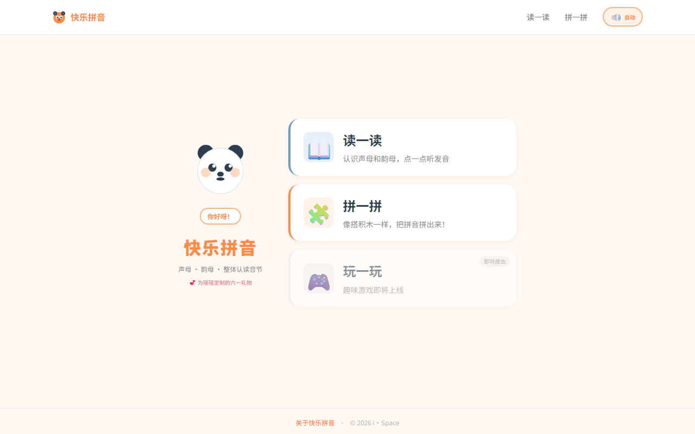
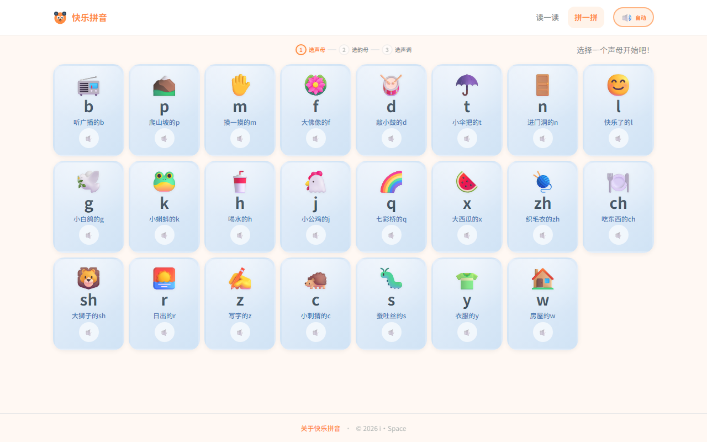
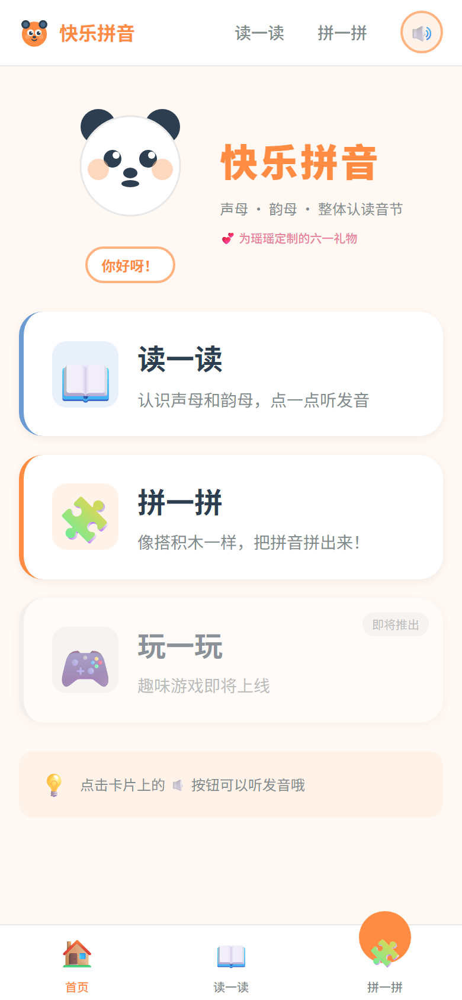
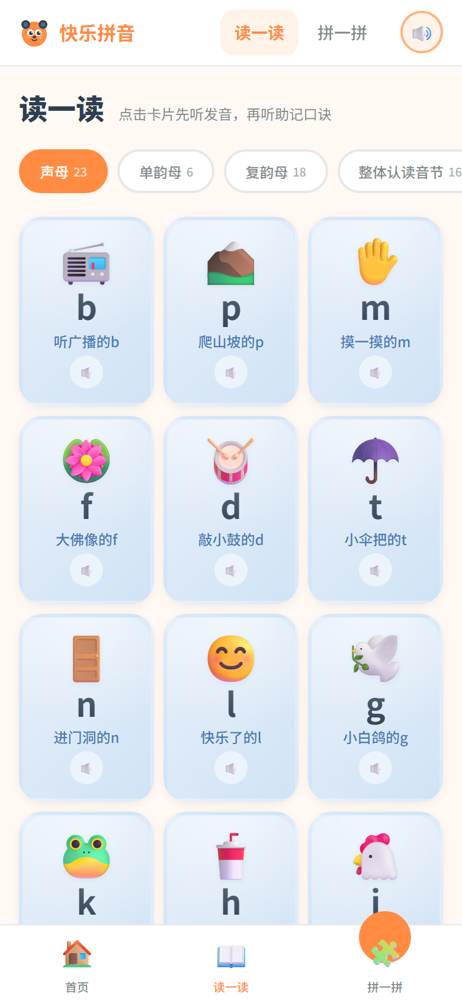

<!--
  🐼 快乐拼音 HappyPinYin
  爸爸写给瑶瑶的六一儿童节礼物
  愿每一个打开这个应用的孩子，都能感受到拼音的乐趣
-->

<div align="center">


# 🐼 快乐拼音 HappyPinYin

*一个爸爸写给女儿的拼音学习乐园*

[](https://vuejs.org)
[](https://www.typescriptlang.org)
[](https://vitejs.dev)
[](https://github.com/ispace-top/HappyPinyin/actions)
[](LICENSE)

</div>

---

<div align="center">

### 🌟 致瑶瑶

> *亲爱的瑶瑶宝贝，这是爸爸写给你的六一儿童节礼物。*
>
> *愿你在拼音的世界里快乐探索，*
> *像拼拼小熊猫一样勇敢、好奇、闪闪发光。*
>
> *爸爸永远爱你，愿你健康快乐地长大！*
>
> 🐼💕

</div>

---

<div align="center">

## 📱 预览

### 🖥️ 桌面端

<table>
<tr>
<td align="center">
  <br/>
  <sub><b>🏠 首页</b> — 小熊猫拼拼带着小朋友进入拼音乐园</sub>
</td>
<td align="center">
  <br/>
  <sub><b>🧩 拼读构建器</b> — 像搭积木一样，一步步拼出汉字读音</sub>
</td>
</tr>
</table>

### 📱 移动端

<table>
<tr>
<td align="center">
  <br/>
  <sub><b>🏠 首页</b> — 专为小手设计的触控入口</sub>
</td>
<td align="center">
  <br/>
  <sub><b>🔤 拼音浏览</b> — 63 个拼音元素，点一点就能听</sub>
</td>
</tr>
</table>

</div>

---

## ✨ 功能特色

<table>
<tr>
<td width="50%">

---

## 🚀 快速开始

```bash
# 环境要求：Node.js 18+
npm install        # 安装依赖
npm run dev        # 启动开发服务器 → http://localhost:5173
npm run build      # 生产构建 → dist/
npm run preview    # 本地预览生产构建
```

> 🔊 **发音功能**：应用使用浏览器内置 SpeechSynthesis API。中文发音需要操作系统安装中文语音包：
>
> - **Windows**：设置 → 时间和语言 → 语音 → 添加语音 → 中文（简体）
> - **macOS**：系统偏好设置 → 辅助功能 → 语音 → 中文
> - **iOS / Android**：已内置中文语音，无需额外配置

---

## 📦 技术栈

| 类别 | 选型                                |
| ---- | ----------------------------------- |
| 框架 | Vue 3 + TypeScript                  |
| 构建 | Vite 6                              |
| 路由 | Vue Router 4（Hash 模式）           |
| 样式 | CSS Modules + CSS Custom Properties |
| 发音 | Web Speech API（SpeechSynthesis）   |
| 部署 | 纯静态 SPA，零后端依赖              |

---

## 📁 项目结构

```
HappyPinYin/
├── docs/                          # 产品需求文档 + UI 设计文档
├── public/
│   └── favicon.svg                # 🐼 小熊猫图标
├── src/
│   ├── main.ts / App.vue          # 入口 + 根布局
│   ├── router/index.ts            # 3 个懒加载路由
│   ├── types/pinyin.ts            # TypeScript 类型定义
│   ├── data/                      # 拼音数据集（静态）
│   │   ├── initials.ts            #   23 声母
│   │   ├── finals.ts              #   6 单韵母 + 18 复韵母
│   │   ├── wholeSyllables.ts      #   16 整体认读音节
│   │   └── syllableCombinations.ts #  ~400 合法拼音组合
│   ├── utils/
│   │   ├── pinyinFilter.ts        #   智能筛选 + 拼音→汉字朗读转换
│   │   ├── toneMark.ts            #   声调标注算法
│   │   └── syllableChars.ts       #   音节→汉字+词组映射
│   ├── services/speechService.ts  #   SpeechSynthesis 封装
│   ├── composables/               #   useSpeech / useBuilder
│   ├── components/                #   UI 组件
│   └── pages/                     #   3 个页面
├── Dockerfile                     # Docker 构建配置
├── nginx.conf                     # Nginx 配置
└── README.md
```

---

## 🐳 部署指南

### 方式一：静态文件托管（推荐 ⭐）

构建产物为纯静态文件，可部署到任意静态服务器。

```bash
npm run build
# 将 dist/ 目录上传至服务器即可
```

#### ▲ Vercel

[](https://vercel.com/new)

```bash
npm i -g vercel
vercel   # 自动识别 Vite 项目，零配置
```

#### ▲ Cloudflare Pages

在 Cloudflare Dashboard 连接 Git 仓库：

- **构建命令**：`npm run build`
- **输出目录**：`dist`
- 无限带宽，全球 CDN

#### ▲ GitHub Pages

```bash
npm i -D gh-pages
npm run build
npx gh-pages -d dist
```

### 方式二：🐳 Docker

```bash
# 拉取预构建镜像
docker pull wapedkj/happy-pinyin:latest

# 运行容器
docker run -d -p 8080:80 --name happy-pinyin wapedkj/happy-pinyin:latest

# 访问 http://localhost:8080
```

**Docker Compose**（`docker-compose.yml`）：

```yaml
services:
  happy-pinyin:
    image: wapedkj/happy-pinyin:latest
    ports:
      - "8080:80"
    restart: unless-stopped
```

### 方式三：Nginx 自建服务器

```bash
npm run build
cp -r dist/ /var/www/happy-pinyin/
```

Nginx 配置已提供在 `nginx.conf` 中。

---

## 📱 打包为移动 App

| 方案                | 安装方式         | 离线 | 上架商店       | 包体积  | 推荐场景         |
| ------------------- | ---------------- | ---- | -------------- | ------- | ---------------- |
| **PWA**       | 浏览器一键安装   | ✅   | —             | ~200 KB | 快速覆盖移动端   |
| **TWA**       | Google Play 下载 | ✅   | ✅ Android     | ~2 MB   | 上架 Google Play |
| **Capacitor** | App Store 下载   | ✅   | ✅ iOS/Android | ~5 MB   | 上架应用商店     |

> **推荐路径**：先添加 PWA 支持（成本最低）→ 后续按需升级到 Capacitor 上架商店。

---

## ❓ 常见问题

<details>
<summary><b>为什么听不到发音？</b></summary>

请检查操作系统是否已安装中文语音包（见上方"快速开始"）。如果浏览器不支持 SpeechSynthesis，发音按钮会显示为灰色 🔇。

</details>

<details>
<summary><b>选完声母后有些韵母不见了？</b></summary>

这是智能筛选功能——不是所有声母都能跟所有韵母拼读（例如 b 不能跟 ü 拼），系统只会显示合法的拼音组合。

</details>

<details>
<summary><b>拼音教学内容是否权威？</b></summary>

教学内容严格遵循人教版/部编版小学语文教材拼音教学大纲，合法拼读组合参考《汉语拼音方案》。

</details>

<details>
<summary><b>可以离线使用吗？</b></summary>

添加 PWA 支持后（见上方"打包为移动 App"）可实现完全离线使用。

</details>

---

<div align="center">

### 💕 写给所有爸爸妈妈

*这是一个还在持续完善的开源项目。*
*如果它帮你家的小朋友学会了第一个拼音，*
*请点一个 ⭐ Star，让更多小朋友看到它。*

*如果你也想为自家宝贝定制一个版本，欢迎 Fork 和 PR！*

[🐼 **快乐拼音 HappyPinYin**](https://github.com/ispace-top/HappyPinyin)

</div>

---

## 📄 许可

MIT License
