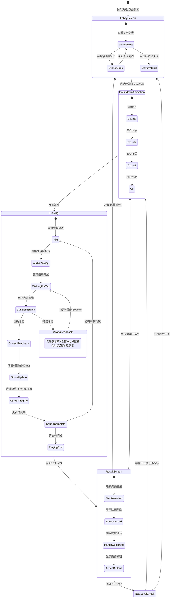
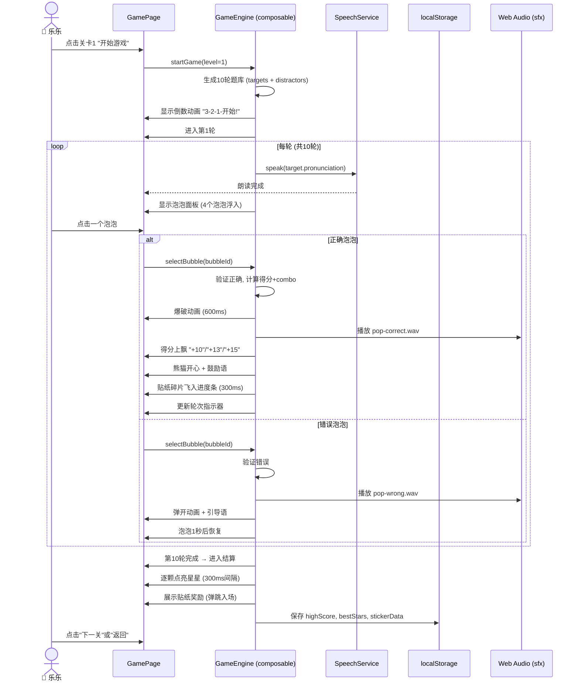

# HappyPinYin 拼音泡泡乐 -- 游戏模块产品需求文档

**文档版本**: v1.0
**创建日期**: 2026-06-05
**文档状态**: 初稿 / 待评审
**关联模块**: HappyPinYin > 玩一玩 (Game Module)
**目标路由**: `/game`

---

## 目录

1. [产品概述](#1-产品概述)
2. [用户分析](#2-用户分析)
3. [游戏设计](#3-游戏设计)
4. [功能需求](#4-功能需求)
5. [交互流程](#5-交互流程)
6. [视听设计方向](#6-视听设计方向)
7. [技术要点](#7-技术要点)
8. [非功能需求](#8-非功能需求)
9. [成功指标](#9-成功指标)
10. [附录](#10-附录)

---

## 1. 产品概述

### 1.1 游戏定位

**拼音泡泡乐 (Pinyin Bubble Pop)** 是一款面向 5-8 岁儿童的"听音识拼音"收集类游戏。孩子听到系统朗读一个拼音发音，然后从屏幕上漂浮的彩色泡泡中找到对应的拼音字母并点破它。正确点破泡泡获得分数和贴纸，集齐一整套贴纸即可解锁成就徽章。

这是 HappyPinYin"玩一玩"模块的唯一游戏，专注于训练**听力识别**技能（听到发音 → 识别拼音符号），与"读一读"（浏览认读）和"拼一拼"（拼读构建）形成互补的完整学习闭环。

### 1.2 核心价值主张

| 维度 | 描述 |
|------|------|
| **教育价值** | 强化"发音→符号"的听觉-视觉映射，这是拼音学习的核心难点之一。通过反复暴露在标准发音与其对应符号之间，帮助儿童建立稳固的语音编码网络 |
| **游戏价值** | 泡泡漂浮 + 点击爆破 + 音效反馈 = 即时满足的爽感循环。集贴纸机制提供中长期目标，激励反复游玩 |
| **情感价值** | 点错泡泡不扣分、不惩罚，泡泡只是弹开并播放鼓励语音。全程正向强化，保护低龄学习者信心 |
| **复用价值** | 可直接驱动现有23个声母、24个韵母、16个整体认读音节数据，无需新增教学数据 |

### 1.3 游戏目标（SMART 原则）

| 目标 | 指标 | 目标值 | 测量方式 |
|------|------|--------|----------|
| **单次游玩完整率** | 完成全部10轮的会话占比 | >= 85% | 会话级埋点 |
| **平均正确率** | 所有完成会话的首次点击正确率均值 | >= 70% | 轮次级埋点 |
| **重复游玩率** | 同一设备7天内回访游戏 >= 2次 | >= 40% | 设备级埋点 (localStorage) |
| **贴纸收集率** | 完成至少1个完整关卡集齐对应贴纸的用户占比 | >= 60% | localStorage 数据 |
| **加载性能** | 从路由跳转到游戏可交互的时间 | < 1.5s | Performance API |

### 1.4 内容边界 (In-Scope / Out-of-Scope)

**In-Scope**:
- 6个难度递进的关卡（每个关卡对应一个拼音类别子集）
- 单次游玩 = 10轮（每轮1个目标拼音 + 4-6个可选泡泡）
- 泡泡爆破动画 + 音效 + 贴纸收集
- 关卡完成后的星级评价和贴纸奖励
- 贴纸书（查看已收集贴纸和成就徽章）
- 熊猫学习伙伴全程陪伴（语音和动画反馈）
- 为触屏和鼠标操作优化的两种交互模式

**Out-of-Scope (本版本不做)**:
- 多人对战或排行榜
- 自定义关卡或家长配置面板
- 拖拽类操作（仅支持点击/触摸）
- 限时模式（倒计时会增加焦虑，待验证后再考虑）
- 书写/描红功能
- 故事模式或叙事元素
- 后台账号系统（全部进度存储在 localStorage）

---

## 2. 用户分析

### 2.1 主要用户画像

**Persona: 乐乐，6岁，幼儿园大班**

| 属性 | 描述 |
|------|------|
| **拼音基础** | 认识大部分声母和韵母的"样子"，但把样子和发音对上号还不熟练。看到 `zh` 可能读成 `z`，听到"吃"可能找不到 `ch` |
| **注意力** | 单次专注 8-12 分钟，但如果有持续的反馈刺激（音效+动画），可以延长到 15 分钟 |
| **操作习惯** | 在平板上用食指点触，偶尔误触（手指还没碰到屏幕就以为碰到了）。在 PC 上用鼠标，点击精准但有 0.5-1 秒的决策延迟 |
| **情感模式** | 答对了会兴奋地拍手，想给爸爸妈妈看。答错了会偷偷瞄大人的反应，如果看到皱眉会退缩。极其在意"星星"和"贴纸"的获取 |
| **游戏经验** | 玩过宝宝巴士系列、洪恩识字。熟悉"收集"和"通关"概念 |

**核心 JTBD (Jobs-to-Be-Done)**:
1. 当我听到一个拼音发音时，我想快速找到它对应的字母符号，这样老师点名读的时候我就不会害怕
2. 当我答对了很多题之后，我想要看得见的奖励（贴纸、星星），这样我可以骄傲地给妈妈看
3. 当我遇到分不清的音（比如 `zh` 和 `z`），我想要不丢脸地再试一次，直到我分清楚为止

### 2.2 次要用户画像

**Persona: 乐乐妈妈，34岁，职场家长**

| 属性 | 描述 |
|------|------|
| **需求** | 需要一个"放心让孩子独自玩10分钟"的工具，发音必须标准，不能有广告或付费弹窗 |
| **使用方式** | 把平板递给乐乐然后去做饭，偶尔过来看一眼。希望看到明确的进度证据 |
| **关注点** | 发音是否标准、孩子会不会沉迷（希望有自然结束节点）、操作是否足够简单不用大人一直帮忙 |

---

## 3. 游戏设计

> 本章是本文档最重要的部分，定义了游戏的完整规则、机制和状态流转。

### 3.1 游戏名称与一句话描述

**拼音泡泡乐 (Pinyin Bubble Pop)**

"听到发音，找到拼音，点破泡泡，收集贴纸！"

### 3.2 核心游戏循环 (Core Loop)

```
┌──────────────────────────────────────────┐
│                                            │
│  ① 熊猫说出目标发音                         │
│     "找一找 —— bō!"                        │
│         ↓                                  │
│  ② 泡泡漂浮出现                             │
│     每个泡泡上显示一个拼音文本                │
│         ↓                                  │
│  ③ 孩子点击一个泡泡                          │
│         ↓                                  │
│  ┌───── 判断 ─────┐                        │
│  │               │                         │
│  正确            错误                        │
│  │               │                         │
│  ▼               ▼                         │
│  ④a 泡泡爆破     ④b 泡泡弹开                 │
│  +10分 +音效    无扣分 +"再试试~"            │
│  彩色碎片飞出    泡泡2秒后恢复                │
│         ↓         ↓                        │
│  ⑤ 熊猫夸奖      回到③（继续选）             │
│         ↓                                  │
│  ⑥ 贴纸碎片飞入                             │
│     收集进度条                               │
│         ↓                                  │
│  ⑦ 下一轮（回到①）                         │
│     直到完成10轮                            │
│         ↓                                  │
│  ⑧ 结算界面                                 │
│     星级评价 + 贴纸奖励 + 熊猫表扬            │
│                                            │
└──────────────────────────────────────────┘
```

### 3.3 核心机制详解

#### 3.3.1 题库生成

游戏使用现有的三套拼音数据作为题库池：

| 关卡 | 名称 | 题库来源 | 题目数 | 选项数 | 适用场景 |
|------|------|----------|--------|--------|----------|
| 1 | 单韵母乐园 | `singleFinals` (6个) | 10轮 | 4个泡泡 | 入门，音素区分度大 |
| 2 | 声母启蒙 (上) | b,p,m,f,d,t,n,l (8个) | 10轮 | 4个泡泡 | 常见声母，发音差异明显 |
| 3 | 声母启蒙 (下) | g,k,h,j,q,x (6个) | 10轮 | 5个泡泡 | 舌根音+舌面音 |
| 4 | 声母挑战 | zh,ch,sh,r,z,c,s,y,w (10个) | 10轮 | 5个泡泡 | 翘舌/平舌区分是重点 |
| 5 | 复韵母探险 | `compoundFinals` (18个) | 10轮 | 6个泡泡 | 多字母韵母，视觉复杂度增加 |
| 6 | 拼音大师 | 全部63个元素混搭 | 10轮 | 6个泡泡 | 终极挑战，综合能力检验 |

每轮的**目标拼音**从当前关卡的题库中随机抽取，保证同一轮不重复。
每轮的**干扰项**从当前关卡的题库中随机抽取（排除目标），保证干扰项互不相同且不等于目标。

**干扰项选取策略**（关键设计决策）:
- 关卡1-2：优先选择与目标"发音不相似"的干扰项（如目标 `a`，不选 `o` 和 `e`，选 `i`、`u`、`ü`）。利用预定义的"易混淆组"排除相似发音项。
- 关卡3-6：纯随机抽取（故意制造混淆以提升辨识能力）。

**易混淆组定义**（用于低难度关卡排除）:
```
Group_1: { zh, z, ch, c, sh, s }      // 翘舌 vs 平舌
Group_2: { n, l }                       // 鼻音 vs 边音
Group_3: { b, p, d, t }                // 爆破音家族
Group_4: { j, q, x }                   // 舌面音
Group_5: { an, ang, en, eng, in, ing } // 前鼻音 vs 后鼻音
Group_6: { ai, ei, ao, ou }           // 复韵母易混组
```

**说明**: 关卡1-2时，若从易混淆组中选定目标，则从题库中随机抽取干扰项时避开同组成员。此逻辑仅在低难度关卡激活。

#### 3.3.2 计分规则

| 事件 | 分数 | 说明 |
|------|------|------|
| 首次点击正确 | +10 | 基础得分 |
| 连续正确加成 (combo >= 3) | +3 per combo | combo=3时+3，combo=4时+3... 连续正确越多额外分越多 |
| 连续正确加成 (combo >= 6) | +5 per combo | combo=6时+5，鼓励持续正确 |
| 第二次点击正确 | +6 | 第一次选错后修正，得分打折 |
| 第三次及以上点击正确 | +3 | 多次尝试后得分更低 |
| 点击错误 | 0 | **不扣分**，这是核心设计原则 |

**单轮满分**: 10 + 3 + 3 + 3 + 3 + 5 + 5 + 5 + 5 + 5 = 如果10轮全部首次正确，总分为:
- 基础分 10×10 = 100
- combo 加成: 轮3(+3), 轮4(+3), 轮5(+3), 轮6(+5), 轮7(+5), 轮8(+5), 轮9(+5), 轮10(+5) = 34
- **理论满分**: 134 分

**单次游玩满分 (10轮全部首次点击正确)**: 134 分

#### 3.3.3 星级评价

结算时根据得分（满分134）转换为三星评价：

| 星级 | 条件 | 贴纸奖励 |
|------|------|----------|
| ⭐⭐⭐ 三颗星 | 得分 >= 120 (正确率 >= 90%) | 获得该关卡贴纸 |
| ⭐⭐ 两颗星 | 得分 >= 80 (正确率 >= 60%) | 获得该关卡贴纸（边框银色） |
| ⭐ 一颗星 | 得分 >= 40 | 获得该关卡贴纸（边框铜色） |
| 无星 | 得分 < 40 | 不获得贴纸，熊猫鼓励"再来一次吧!" |

**设计理由**: 即使得分很低也不给"失败"标签，而是"还没收集到贴纸哦，再试试!"的鼓励式表达。

#### 3.3.4 贴纸收集系统

贴纸是游戏中长期激励的核心。每个关卡对应一枚主题贴纸：

| 关卡 | 贴纸名称 | 贴纸图案 | 解锁条件 |
|------|----------|----------|----------|
| 1 | 韵母小芽 | 嫩绿小芽 🌱 | 关卡1 >= 1星 |
| 2 | 声母小苗 | 小树苗 🪴 | 关卡2 >= 1星 |
| 3 | 舌根勇士 | 金色盾牌 🛡️ | 关卡3 >= 1星 |
| 4 | 翘舌之星 | 闪亮星星 ⭐ | 关卡4 >= 1星 |
| 5 | 复韵之花 | 缤纷花朵 🌸 | 关卡5 >= 1星 |
| 6 | 拼音大师 | 皇冠奖杯 👑 | 关卡6 >= 1星 |

**成就徽章**（集齐贴纸解锁）:
- 集齐关1-2贴纸 → **"初学小能手"** 徽章
- 集齐关3-4贴纸 → **"声母小达人"** 徽章
- 集齐关5贴纸 → **"韵母探险家"** 徽章
- 集齐全部6张贴纸 → **"拼音大师"** 金色徽章

### 3.4 难度递进曲线

```
难度
  │
  │                              关卡6: 63选6
  │                           ╱
  │                    关卡5: 18选6
  │                  ╱
  │            关卡4: 10选5
  │          ╱
  │    关卡3: 6选5
  │  ╱
  │关卡2: 8选4      关卡1作为教学关
  │关卡1: 6选4      干扰项排除易混音
  │
  └──────────────────────────────→ 关卡
     1    2     3     4     5     6
```

**难度维度拆解**:
1. **选项数量**: 4 → 5 → 6 (增加选择难度)
2. **题库大小**: 6 → 8 → 6 → 10 → 18 → 63 (增加记忆搜索广度)
3. **拼音复杂度**: 单字母 → 双字母 → 多字母 → 全类别 (增加视觉处理难度)
4. **混淆度**: 主动排除易混项 → 被动接受混淆 → 故意制造混淆 (增加听觉辨识难度)

**设计说明**: 关卡1有意做成"必过"级别（选项少 + 干扰项不相似），目的是让孩子建立"我能行"的信心，而不是在第一个关卡就遭遇挫折。

### 3.5 游戏状态机



### 3.6 关卡解锁规则

- **关卡1（单韵母乐园）**: 始终解锁（默认可用）
- **后续关卡解锁**: 上一关至少获得 1 颗星即可解锁下一关
- **关卡可重玩**: 已完成关卡可无限次重玩，最新最高分覆盖历史分数
- **解锁状态持久化**: 存储在 localStorage 中

---

## 4. 功能需求

### 4.1 游戏大厅 (Game Lobby)

#### FR-GL-01: 关卡选择界面
**描述**: 游戏入口界面，展示所有6个关卡，每个关卡以卡片形式呈现。卡片上显示关卡序号、名称、emoji图标、已获最高星数、已获贴纸状态和锁定状态。

**界面元素**:
- 页面标题区: "拼音泡泡乐" + 熊猫吉祥物
- 关卡卡片网格: 2列 x 3行 (移动端) / 3列 x 2行 (平板及以上)
- "我的贴纸"按钮: 右上角，带贴纸簿图标和已收集数量角标
- "返回首页"按钮: 左上角

**关卡卡片状态**:

| 状态 | 视觉表现 |
|------|----------|
| 已解锁-未玩过 | 正常色彩，显示"新!"角标 |
| 已解锁-已玩过 | 正常色彩，显示星数(⭐/⭐⭐/⭐⭐⭐) |
| 已解锁-已收集贴纸 | 正常色彩，贴纸叠在卡片右下角 |
| 锁定中 | 灰色调，显示🔒图标，不可点击 |

**验收标准 (Gherkin)**:
```gherkin
Given 用户首次进入游戏大厅
Then 关卡1卡片显示为正常色彩并带"新!"角标
And 关卡2-6卡片显示为灰色锁定状态并带🔒图标
And "我的贴纸"按钮旁显示"0/6"

Given 用户在关卡1中获得至少1颗星
When 用户返回游戏大厅
Then 关卡2卡片变为解锁状态
And 关卡1卡片显示对应的星星数

Given 用户点击锁定中的关卡卡片
Then 没有任何反应（不弹出提示，不改变路由）
```

#### FR-GL-02: 贴纸书
**描述**: 展示已收集和未收集的贴纸及成就徽章的合集界面。

**界面元素**:
- 贴纸网格: 6张贴纸槽位，已收集显示彩色贴纸，未收集显示灰色剪影
- 成就徽章区: 4个徽章槽位，已解锁显示彩色徽章+动画，未解锁显示灰色轮廓
- 集齐进度提示: "已收集 X/6 张贴纸"
- 关闭按钮: 返回关卡选择界面

**验收标准**:
```gherkin
Given 用户在关卡1中获得了贴纸
When 用户打开贴纸书
Then 第1个槽位显示彩色"韵母小芽"贴纸
And 第2-6个槽位显示灰色剪影
And 已收集数量显示为"1/6"

Given 用户已收集关卡1和关卡2的贴纸
When 用户打开贴纸书
Then "初学小能手"徽章显示为彩色解锁状态
And 徽章上带有淡淡的光晕动画（表示首次解锁）
```

### 4.2 游戏核心玩法

#### FR-GP-01: 倒数动画
**描述**: 点击"开始游戏"后展示3-2-1倒数动画，帮助孩子做好注意力准备。

**视觉设计**:
- 全屏半透明遮罩背景
- 中央大号数字依次显示: 3 → 2 → 1 → "开始!"
- 每个数字持续 400ms，从 1.2 倍缩放到 1.0 倍（弹性缓出）
- "开始!"显示 500ms 后自动消失，游戏开始

**验收标准**:
```gherkin
Given 用户点击"开始游戏"按钮
Then 屏幕显示倒数动画"3"→"2"→"1"→"开始!"
And 倒数结束后游戏自动开始，无需额外点击
And 动画总时长约 1.7 秒
```

#### FR-GP-02: 目标音播放
**描述**: 每轮开始时，系统通过 TTS 朗读目标拼音的发音，并同步在屏幕顶部显示提示文字。

**行为细节**:
- 熊猫气泡显示文字: "找一找 —— [拼音文本]"
- TTS 朗读: `pinyinToSpeech(拼音文本)` 后的中文发音
- 朗读时机: 新轮次开始时自动播放
- 朗读完成后: 泡泡面板从下方浮入（延迟 300ms，让听觉信息先到达）

**朗读文案映射表** (示例):
| 拼音 | TTS实际朗读 | 熊猫气泡文案 |
|------|------------|-------------|
| b | "播" | 找一找 —— b |
| zh | "知" | 找一找 —— zh |
| ai | "挨" | 找一找 —— ai |
| ang | "昂" | 找一找 —— ang |

**验收标准**:
```gherkin
Given 游戏进入新的一轮
When 目标拼音为"b"
Then TTS朗读"播"的发音
And 熊猫气泡显示"找一找 —— b"
And 泡泡在TTS开始播放250ms后从底部浮入

Given 孩子想再听一遍发音
When 孩子点击熊猫或"🔈重听"按钮
Then 系统重新朗读目标音（不视为一次选择）
And 泡泡面板保持不动
```

#### FR-GP-03: 泡泡面板
**描述**: 显示4-6个可点击的泡泡，每个泡泡上显示一个拼音文本。泡泡以轻微上下浮动动画呈现（模拟真实泡泡的漂动感）。

**泡泡属性**:

| 属性 | 值 |
|------|-----|
| 最小触控尺寸 | 80px × 80px (移动端) / 96px × 96px (桌面端) |
| 形状 | 圆形 (border-radius: 50%) |
| 填充色 | 随机从泡泡色板中选取（每个泡泡不同颜色） |
| 字体 | `font-family: 'Nunito', 'PingFang SC', sans-serif; font-weight: 700` |
| 字体大小 | `zh`/`ch`/`sh` 等双字母声母: 1.4rem; 单字母: 1.8rem; 复韵母: 1.1rem |
| 浮动动画 | `transform: translateY(0) → translateY(-8px) → translateY(0)`，循环周期 2.5s，每个泡泡相位不同（错峰浮动避免整齐划一） |
| 光晕效果 | 半透明白色高光点在泡泡左上角（CSS radial-gradient 实现），模拟玻璃/泡泡质感 |
| 颜色色板 | `#FF6B6B`(珊瑚红), `#4ECDC4`(湖蓝), `#FF8C42`(橘黄), `#FFB380`(蜜橙), `#7EC8A0`(薄荷绿), `#F0C75E`(鹅黄), `#6C9BD2`(天蓝), `#E8839A`(樱花粉) |

**布局**:
- 移动端: 2列 × 2-3行，泡泡均匀分布
- 平板端: 3列 × 2行
- 桌面端: 横排一行（可用空间 >= 600px时）

**验收标准**:
```gherkin
Given 当前关卡为关卡1（4个泡泡）
When 新轮次开始
Then 4个泡泡从屏幕底部浮入（动画持续400ms，弹性缓出）
And 每个泡泡颜色不同
And 每个泡泡有独立的浮动相位
And 所有泡泡的触控尺寸 >= 80px

Given 用户点击了错误泡泡
Then 该泡泡执行"弹开"动画（缩小到0.7倍 + 轻微旋转 + 1秒后恢复原状）
And 其他泡泡不受影响
And 该泡泡恢复后可被再次点击

Given 用户点击了正确泡泡
Then 该泡泡执行"爆破"动画（从中间炸开，彩色碎片向四周飞散）
And 所有其他泡泡同时淡出消失
And 进入得分反馈阶段
```

#### FR-GP-04: 正确反馈
**描述**: 当孩子点击了正确的泡泡，播放连环正向反馈。

**反馈序列（时序精确控制）**:
1. **t=0ms**: 泡泡爆破动画开始，音效 "pop-correct.wav" 播放
2. **t=150ms**: 得分数字从爆破中心飞出并上飘（"+10" / "+13" / "+15"）
3. **t=200ms**: 彩色纸屑粒子从爆破点向四周散射（复用并增强 CelebrationEffect 组件）
4. **t=300ms**: 熊猫切换为"happy"表情，气泡显示随机鼓励语
5. **t=400ms**: 可继续操作的贴纸碎片飞行动画

**鼓励语池（随机抽取，避免重复感）**:
```
"太棒了! 🎉"
"真聪明! ⭐"
"答对啦! 🌟"
"你真厉害! 💪"
"就是它! ✨"
"完美! 🎯"
```

**验收标准**:
```gherkin
Given 用户点击了正确的泡泡
Then 泡泡爆破动画立即播放
And 得分数字上飘（带"+N"文字和缩放效果）
And 彩色纸屑粒子散射
And 熊猫表情变为开心状态
And 熊猫气泡显示一句随机鼓励语

Given 用户在得分动画播放期间点击屏幕
Then 动画不会被中断（防止误触跳过反馈）
```

#### FR-GP-05: 错误反馈
**描述**: 当孩子点击了错误的泡泡，给予温柔的重试引导，绝不使用惩罚或负面表达。

**反馈序列**:
1. **t=0ms**: 被点泡泡执行"弹开"动画（缩小 + 微旋转）
2. **t=0ms**: 音效 "pop-wrong.wav" 播放（比爆破音效更轻更短）
3. **t=200ms**: 熊猫气泡显示引导语（不改变表情，保持温和）
4. **t=1000ms**: 弹开的泡泡恢复原状，可被再次点击

**引导语池**:
```
"再试试看~"
"差一点点，再找找!"
"听听看，是哪个呢?"
"没关系，再来!"
```

**验收标准**:
```gherkin
Given 用户点击了错误的泡泡
Then 该泡泡执行弹开动画（不消失）
And 不扣除任何分数
And 熊猫不改变为开心表情
And 显示一条随机引导语

Given 用户连续3次点错同一个泡泡
Then 系统不干预（不自动排除、不高亮提示）
And 孩子可以在任意次数尝试后自行找到正确答案
```

#### FR-GP-06: 贴纸碎片收集
**描述**: 每轮结束后，一个贴纸碎片从屏幕中央飞入顶部的进度条区域。集满10个碎片后（即完成全部10轮），拼成完整贴纸（如果达到星级标准）。

**视觉表现**:
- 碎片形状: 拼图锯齿状小色块
- 飞行路径: 贝塞尔曲线（起点=爆破中心，终点=进度条当前位置）
- 飞行时长: 300ms
- 进度条: 10个槽位，每个槽位在对应轮次完成后变为亮色
- 进度条位置: 屏幕顶部，熊猫头像旁边

**各关卡进度条主题色**:
| 关卡 | 进度条填充色 |
|------|-------------|
| 1 | #7EC8A0 (薄荷绿) |
| 2 | #4ECDC4 (湖蓝) |
| 3 | #FFB380 (蜜橙) |
| 4 | #6C9BD2 (天蓝) |
| 5 | #E8839A (樱花粉) |
| 6 | #F0C75E (金奖黄) |

**验收标准**:
```gherkin
Given 用户正确回答了一轮
When 贴纸碎片飞行动画开始
Then 碎片沿贝塞尔曲线飞向顶部进度条
And 飞行动画在300ms内完成
And 进度条对应槽位亮起

Given 用户完成第10轮
When 得分 >= 40（至少1星）
Then 进度条10个槽位全部亮起
And 完整贴纸在进度条中央展示（放大 + 旋转入场动画）
```

#### FR-GP-07: 游戏进度管理
**描述**: 游戏共10轮，每轮独立。有一个随时可见的轮次指示器。

**轮次指示器**:
- 位于泡泡面板上方
- 显示格式: "第 X / 10 题"
- 已完成轮次: 实心圆点
- 当前轮次: 高亮大圆点
- 未完成轮次: 空心圆点

**验收标准**:
```gherkin
Given 用户正在进行第5轮
Then 轮次指示器显示"第 5 / 10 题"
And 前4个圆点为实心（完成）
And 第5个圆点放大高亮（进行中）
And 后5个圆点为空心（待完成）
```

### 4.3 结算界面

#### FR-RS-01: 星星动画
**描述**: 游戏结束后，根据得分展示星级评价动画。星星逐个点亮，有节奏感。

**动画时序**:
- t=0ms: 结算面板从底部滑入（弹窗/半屏形式）
- t=400ms: 第一颗星星出现
- t=700ms: 第二颗星星出现（若达标）
- t=1000ms: 第三颗星星出现（若达标）
- 星星出现动画: 从0缩放至1.3倍再回弹至1.0倍 + 旋转360度 + 金色光晕扩散

**验收标准**:
```gherkin
Given 用户获得2星评价
Then 结算界面展示2颗实心金星 + 1颗空心灰星
And 2颗金星依次点亮（间隔300ms）
And 每颗星点亮时带有缩放+旋转动画

Given 用户获得3星评价
Then 3颗金星全部点亮
And 额外的金色粒子效果在星星周围持续闪烁
```

#### FR-RS-02: 贴纸发放
**描述**: 若得分达标（>= 40分），发放对应关卡贴纸，展示获取动画。

**动画表现**:
- 贴纸从屏幕中央出现，带缩放弹跳效果（0 → 1.2 → 0.9 → 1.0）
- 贴纸外框根据星级变色: 3星=金色边框 + 光晕, 2星=银色边框, 1星=铜色边框
- 贴纸下方显示文字: "获得贴纸: [贴纸名称]!"
- 如果是首次获得（该关卡此前最高分 < 40），额外播放"首次收集"彩带特效
- 如果是刷新最高分（替代旧星级），显示"新纪录!"角标

**验收标准**:
```gherkin
Given 用户首次在关卡3获得3星
Then 贴纸以金色边框呈现并带有缩放弹跳动画
And 显示文字"获得贴纸: 舌根勇士!"
And 播放"首次收集"彩带特效
And 贴纸数据写入 localStorage

Given 用户重玩关卡2，得分从2星提升到3星
Then 贴纸边框从银色升级为金色
And 显示"新纪录!"角标
```

#### FR-RS-03: 操作按钮
**描述**: 结算界面提供三个操作路径。

| 按钮 | 标签 | 图标 | 行为 |
|------|------|------|------|
| 再玩一次 | "🔄 再玩一次" | 刷新图标 | 重新进入当前关卡的倒数动画 |
| 下一关 | "▶ 下一关" | 箭头图标 | 进入下一关（若已解锁），否则灰色不可点击 |
| 返回关卡 | "📋 返回关卡" | 列表图标 | 回到游戏大厅关卡选择界面 |

**验收标准**:
```gherkin
Given 用户完成关卡1并获得了星级
When 结算界面显示
Then "下一关"按钮为可用状态
And 点击"下一关"后进入关卡2的倒数动画

Given 用户完成关卡6（最后一关）
When 结算界面显示
Then "下一关"按钮显示为灰色不可点击状态
And 按钮标签改为"已是最后一关"
```

### 4.4 持久化存储

#### FR-ST-01: 游戏数据存储
**描述**: 所有游戏进度数据存储在浏览器的 localStorage 中，结构如下。

**存储键**: `happypinyin_game_data`

**数据结构** (TypeScript 定义):
```typescript
interface GameSaveData {
  version: 1
  levels: Record<number, LevelProgress>
  stickers: string[]           // 已收集贴纸ID列表
  achievements: string[]       // 已解锁成就ID列表
  lastPlayedAt: string         // ISO 8601 时间戳
  totalGamesPlayed: number     // 总游玩次数
}

interface LevelProgress {
  highScore: number            // 最高得分
  bestStars: 0 | 1 | 2 | 3    // 历史最高星级
  attempts: number             // 挑战次数
  stickerCollected: boolean    // 是否已获得贴纸
  stickerGrade: 'gold' | 'silver' | 'bronze' | null  // 贴纸品质
}
```

**验收标准**:
```gherkin
Given 用户首次打开游戏
Then localStorage 中不存在 happypinyin_game_data 键
And 系统创建默认数据（关卡1解锁，其余锁定）

Given 用户完成一局游戏
When 游戏数据写入 localStorage
Then 对应关卡的 highScore、bestStars、attempts 被更新
And totalGamesPlayed 递增1
And lastPlayedAt 更新为当前时间
```

---

## 5. 交互流程

### 5.1 整体页面结构（线框图描述）

```
┌──────────────────────────────────────┐
│  ← 返回    拼音泡泡乐    🧸 0/6      │  ← 顶部导航栏 (复用 AppHeader)
├──────────────────────────────────────┤
│                                      │
│  [关卡选择网格 / 贴纸书 / 游戏界面]     │  ← 主内容区（根据状态切换）
│                                      │
├──────────────────────────────────────┤
│  (游戏进行中: 进度条 + 轮次指示器)      │  ← 游戏内 HUD
└──────────────────────────────────────┘
```

### 5.2 游戏大厅页面 (LobbyPage)

```
┌───────────────────────────────────────────┐
│  🐼 "来玩拼音泡泡吧!"      [🧸 我的贴纸]  │
│  点击泡泡，找到正确的拼音~                  │
├───────────────────────────────────────────┤
│                                           │
│   ┌──────────────┐  ┌──────────────┐      │
│   │  🌱 第一关    │  │  🪴 第二关    │      │
│   │  单韵母乐园   │  │  声母启蒙(上) │      │
│   │  ⭐⭐⭐       │  │  🔒          │      │
│   │  [已收集]    │  │  [未解锁]    │      │
│   └──────────────┘  └──────────────┘      │
│                                           │
│   ┌──────────────┐  ┌──────────────┐      │
│   │  🛡️ 第三关   │  │  ⭐ 第四关    │      │
│   │  舌根勇士     │  │  翘舌之星     │      │
│   │  🔒          │  │  🔒          │      │
│   └──────────────┘  └──────────────┘      │
│                                           │
│   ┌──────────────┐  ┌──────────────┐      │
│   │  🌸 第五关    │  │  👑 第六关    │      │
│   │  复韵母探险   │  │  拼音大师     │      │
│   │  🔒          │  │  🔒          │      │
│   └──────────────┘  └──────────────┘      │
│                                           │
└───────────────────────────────────────────┘
```

### 5.3 游戏进行中页面 (GamePlayPage)

```
┌───────────────────────────────────────────┐
│  🧸 找一找 —— b           第 5 / 10 题    │  ← 熊猫气泡 + 轮次指示器
│  [🔈 再听一次]                            │  ← 重听按钮
├───────────────────────────────────────────┤
│  ◉◉◉◉◎○○○○○                             │  ← 进度条（4完成 + 1当前 + 5待完成）
│                                           │
│                                           │
│      ┌───┐    ┌───┐     ┌───┐    ┌───┐   │
│      │   │    │   │     │   │    │   │   │
│      │ p │    │ b │     │ d │    │ m │   │  ← 4个浮动泡泡（上下微动）
│      │   │    │   │     │   │    │   │   │
│      └───┘    └───┘     └───┘    └───┘   │
│                                           │
│                                           │
│  得分: 52  连击: x3                        │  ← 分数 + combo状态
└───────────────────────────────────────────┘
```

**交互行为**:
1. 页面加载 → TTS 自动播放目标音 "播"
2. 泡泡从底部浮入（延迟250ms）
3. 孩子点击泡泡 → 触发正确/错误反馈
4. 正确 → 爆破动画 → 得分上飘 → 贴纸碎片飞入进度条 → 300ms空白过度 → 下一轮
5. 错误 → 弹开动画 → 引导语 → 泡泡恢复 → 继续选

**关键交互细节**:
- 泡泡面板区域外点击无响应
- 得分动画期间 (0-600ms) 新泡泡不出现，防止连击误触
- 重听按钮点击后，当前泡泡面板保持不变（不中断游戏流程）
- 每轮之间的过渡时间: 约1000ms（包含爆破动画600ms + 碎片飞行300ms + 缓冲100ms）

### 5.4 结算界面 (ResultPage / 弹窗)

```
┌───────────────────────────────────────────┐
│                                           │
│              🐼 (开心表情)                  │
│            "太厉害了!"                     │
│                                           │
│          ⭐    ⭐    ⭐                     │  ← 三颗金星
│                                           │
│      ┌─────────────────────┐              │
│      │     🌱 韵母小芽      │              │  ← 贴纸展示（带金色边框）
│      │   获得贴纸: 韵母小芽  │              │
│      └─────────────────────┘              │
│                                           │
│      得分: 128    正确: 10/10              │  ← 统计数据
│      连击最高: 10x                        │
│                                           │
│   [🔄 再玩一次]  [▶ 下一关]  [📋 返回]     │  ← 操作按钮
│                                           │
└───────────────────────────────────────────┘
```

### 5.5 贴纸书页面 (StickerBookPage)

```
┌───────────────────────────────────────────┐
│  ← 返回                  我的贴纸书        │
├───────────────────────────────────────────┤
│           "已收集 2 / 6 张贴纸"            │
│                                           │
│   ┌──────┐ ┌──────┐ ┌──────┐             │
│   │ 🌱   │ │ 🪴   │ │      │             │
│   │韵母  │ │声母  │ │  ?   │   ← 贴纸网格 │
│   │小芽  │ │小苗  │ │      │             │
│   └──────┘ └──────┘ └──────┘             │
│                                           │
│   ┌──────┐ ┌──────┐ ┌──────┐             │
│   │      │ │      │ │      │             │
│   │  ?   │ │  ?   │ │  ?   │             │
│   │      │ │      │ │      │             │
│   └──────┘ └──────┘ └──────┘             │
│                                           │
│   ──── 成就徽章 ────                       │
│                                           │
│   🏅 初学小能手 (已解锁)                   │
│   🔒 声母小达人 (收集关3-4贴纸解锁)         │
│   🔒 韵母探险家 (收集关5贴纸解锁)           │
│   🔒 拼音大师 (收集全部贴纸解锁)            │
│                                           │
└───────────────────────────────────────────┘
```

### 5.6 空状态与边界情况处理

| 场景 | 处理方式 |
|------|----------|
| 首次进入游戏（无任何进度） | 关卡1高亮显示"新!"角标，其他关卡全部锁定。贴纸书按钮显示"0/6" |
| 所有关卡已通关但未全三星 | 关卡卡片显示当前最高星级，允许重玩。贴纸书显示已收集贴纸和缺失贴纸的剪影 |
| 所有关卡三星 + 全部贴纸 | 游戏大厅显示"恭喜你成为拼音大师!"横幅 + 所有卡片带金色边框 + 贴纸书全满 |
| TTS 加载失败（浏览器不支持） | 显示提示"你的浏览器不支持语音功能，请在爸爸妈妈的帮助下使用 Chrome 或 Edge 浏览器打开"（儿童友好表达） |
| TTS 朗读中途被打断 | 无影响，新轮次的语音会 cancel 旧语音并重新播放 |
| localStorage 已满或被禁用 | 静默降级：游戏可正常游玩但进度不保存。关闭页面后进度丢失。不弹出任何警告（对孩子无意义） |
| 用户中途点击浏览器返回 | 游戏状态丢失（不保留中场进度），返回游戏大厅 |
| 网络断开 | 无影响，纯前端应用，所有数据本地化 |
| 屏幕旋转（横屏↔竖屏） | 泡泡重新排列适配新布局，当前轮次不中断 |

### 5.7 完整交互序列图



---

## 6. 视听设计方向

### 6.1 整体氛围

**设计关键词**: 糖果色、通透、泡泡、梦幻、温暖

**情绪曲线**: 进入时的期待感 → 游戏中的专注 + 轻松 → 正确时的喜悦 → 结算时的成就感 → 收集贴纸后的"还想再来"

### 6.2 色彩体系

**泡泡面板背景**: 柔和渐变 `linear-gradient(180deg, #E8F8FF 0%, #FFF5E8 100%)` — 从浅蓝天渐变到暖黄，营造温暖天空感

**泡泡色板** (已在 4.2 FR-GP-03 定义):
- `#FF6B6B` 珊瑚红
- `#4ECDC4` 湖蓝
- `#FF8C42` 橘黄
- `#FFB380` 蜜橙
- `#7EC8A0` 薄荷绿
- `#F0C75E` 鹅黄
- `#6C9BD2` 天蓝
- `#E8839A` 樱花粉

**结算界面星级色**:
- 点亮金星: `#F0C75E` (鹅黄) + `box-shadow: 0 0 12px rgba(240,199,94,0.6)` 金色光晕
- 空心灰星: `#D4D4D4` (浅灰)

**贴纸品质色**:
- 金色边框: `#F0C75E` + inner glow
- 银色边框: `#C0C0C0`
- 铜色边框: `#CD7F32`

**锁定状态色**: 灰色调 `opacity: 0.4; filter: grayscale(100%)`

### 6.3 音效设计

所有音效文件使用 Web Audio API 或 HTML5 `<audio>` 元素播放，格式为 `.wav`（短音效）或 `.mp3`（语音）。

| 音效ID | 文件 | 描述 | 时长 | 触发时机 |
|--------|------|------|------|----------|
| `pop-correct` | pop-correct.wav | 清脆的水泡爆破声，带上升音调尾巴 | ~0.3s | 点破正确泡泡 |
| `pop-wrong` | pop-wrong.wav | 闷闷的泡泡声，无上升音调 | ~0.2s | 点错泡泡 |
| `sticker-fly` | sticker-fly.wav | 魔法碎屑飞行声，亮晶晶的 | ~0.3s | 贴纸碎片飞行 |
| `star-appear` | star-appear.wav | 星星点亮声，"叮"的一声 | ~0.4s | 每颗星星出现 |
| `sticker-collect` | sticker-collect.wav | 贴纸收集完成，"叮铃铃"的铃铛声 | ~0.6s | 贴纸发放 |
| `countdown` | countdown.wav | 短促的"嘟嘟"声 | ~0.15s | 倒数3-2-1每拍 |
| `countdown-go` | countdown-go.wav | 上扬的"叮!" | ~0.3s | "开始!" |
| `achievement` | achievement.wav | 管弦乐短句，庆典型 | ~1.5s | 解锁成就徽章 |

**语音**: 使用 SpeechSynthesis TTS（已有 speechService），不需要预录音文件。

**实现注**: 音效文件由开发者自制或从免版税音效库获取。所有音效需在游戏初始化时预加载，避免播放延迟。

### 6.4 动画规范

| 动画名称 | 属性 | 时长 | 缓动函数 | 应用场景 |
|----------|------|------|----------|----------|
| `bubble-float` | translateY: 0→-8px→0 | 2.5s 循环 | ease-in-out | 泡泡待选状态 |
| `bubble-pop` | scale: 1→1.3→0 + opacity: 1→0 | 400ms | cubic-bezier(0.34,1.56,0.64,1) | 正确泡泡爆破 |
| `bubble-bounce` | scale: 1→0.7→1 + rotate: 0→15deg→0 | 1000ms | ease-out | 错误泡泡弹开 |
| `score-float` | translateY: 0→-40px + opacity: 1→0 | 800ms | ease-out | 得分数字上飘 |
| `star-pop` | scale: 0→1.3→1 + rotate: 0→360deg | 500ms | cubic-bezier(0.34,1.56,0.64,1) | 星星出现 |
| `sticker-pop` | scale: 0→1.2→0.9→1 | 600ms | cubic-bezier(0.34,1.56,0.64,1) | 贴纸弹跳入场 |
| `fragment-fly` | 贝塞尔曲线路径 | 300ms | ease-in-out | 碎片飞入进度条 |
| `confetti` | random x/y + fade out | 1200ms | ease-out | 彩纸粒子散射 |

**全局原则**:
- 所有入场动画使用 `prefers-reduced-motion: reduce` 媒体查询的回退方案（直接显示最终状态，跳过动画）
- 动画帧率: 目标 60fps，使用 `requestAnimationFrame` 或 CSS `transform` + `opacity` 确保 GPU 加速
- 禁止使用 `left`/`top`/`margin` 等触发布局的属性做动画

---

## 7. 技术要点

### 7.1 数据使用方式

游戏完全使用现有的四套拼音数据，不新增任何教学数据文件：

```
数据源                         游戏中使用方式
───────────────────────────────────────────────────
src/data/initials.ts          → 关卡2-4的题库 (23个声母)
src/data/finals.ts            → 关卡1的题库 (6单韵母) + 关卡5的题库 (18复韵母)
src/data/wholeSyllables.ts    → 关卡6的题库 (16整体认读音节, 与其他混合)
src/data/syllableCombinations.ts → 可选的辅助校验数据 (当前版本不直接使用)
```

**核心工具函数复用**:
- `pinyinToSpeech()` (来自 `src/utils/pinyinFilter.ts`) — 将拉丁拼音转为 TTS 可读的中文
- `speechService.speak()` (来自 `src/services/speechService.ts`) — 朗读目标发音
- `speechService.stop()` — 中断当前朗读（切换轮次时）

### 7.2 项目文件结构（新增部分）

```
src/
├── pages/
│   └── GamePage.vue                # 游戏主页面（路由容器，在 Lobby / Play / Result 三种视图间切换）
├── components/
│   └── game/
│       ├── GameLobby.vue           # 游戏大厅：关卡选择网格
│       ├── GamePlay.vue            # 游戏核心：泡泡面板 + 轮次控制
│       ├── GameResult.vue          # 结算界面：星星 + 贴纸 + 按钮
│       ├── StickerBook.vue         # 贴纸书：收集展示
│       ├── BubbleItem.vue          # 单个泡泡组件（含浮动动画、点击、爆破/弹开状态）
│       ├── CountdownOverlay.vue    # 3-2-1倒数动画覆盖层
│       ├── ProgressBar.vue         # 贴纸碎片进度条
│       └── StarRating.vue          # 星级展示（支持动画点亮）
├── composables/
│   └── useGameEngine.ts            # 游戏核心状态机：题库生成、计分、combo、轮次管理
├── utils/
│   └── gameStorage.ts              # localStorage 读写封装（GameSaveData 序列化/反序列化）
├── types/
│   └── game.ts                     # 游戏专用类型定义（补充到现有 pinyin.ts 也可）
└── assets/
    └── audio/                      # 音效文件目录
        ├── pop-correct.wav
        ├── pop-wrong.wav
        ├── sticker-fly.wav
        ├── star-appear.wav
        ├── sticker-collect.wav
        ├── countdown.wav
        ├── countdown-go.wav
        └── achievement.wav
```

### 7.3 状态管理设计 (useGameEngine composable)

```typescript
// 核心状态机
interface GameState {
  phase: 'idle' | 'countdown' | 'playing' | 'feedback' | 'result'
  currentLevel: number            // 1-6
  currentRound: number            // 0-9 (10轮)
  rounds: RoundData[]             // 当前游戏的全部10轮数据
  score: number
  combo: number
  maxCombo: number
  correctFirstTry: number         // 首次点击正确次数
  totalClicks: number
  feedbackType: 'correct' | 'wrong' | null
}

// 每轮数据
interface RoundData {
  target: PinyinElement            // 本轮目标拼音
  options: PinyinElement[]         // 候选泡泡列表（含正确项和干扰项，已打乱顺序）
  answeredCorrectly: boolean       // 本轮是否最终正确
  clicksThisRound: number          // 本轮点击次数
}

// 游戏引擎暴露的响应式数据和方法
function useGameEngine() {
  const state: Ref<GameState>
  const currentRoundData: ComputedRef<RoundData | null>

  function startGame(level: number): void          // 初始化 + 生成10轮题库
  function nextRound(): void                       // 推进到下一轮（或触发结算）
  function selectBubble(bubbleId: string): void    // 处理泡泡选择
  function replayAudio(): void                     // 重播当前目标音
  function endGame(): void                         // 提前结束（当前版本不调用，预留）
}
```

### 7.4 题库生成算法

```typescript
function generateRounds(level: LevelConfig): RoundData[] {
  const pool = getLevelPool(level)          // 获取当前关卡题库
  const rounds: RoundData[] = []

  for (let i = 0; i < 10; i++) {
    // 1. 随机抽取目标（不与已生成轮次的目标重复）
    const target = pickRandomTarget(pool, rounds.map(r => r.target.id))

    // 2. 抽取干扰项
    const distractors = pickDistractors(pool, target, level.optionCount - 1, level.avoidConfusionGroups)

    // 3. 合并目标 + 干扰项 并随机打乱顺序
    const options = shuffle([target, ...distractors])

    rounds.push({ target, options, answeredCorrectly: false, clicksThisRound: 0 })
  }

  return rounds
}
```

**干扰项选取逻辑 (pickDistractors)**:
1. 从题库中排除目标自身
2. 若 `level.avoidConfusionGroups === true`（仅关卡1-2），进一步排除与目标同属一个易混淆组的元素
3. 从剩余候选池中随机抽取所需数量
4. 若排除后候选池不够所需数量，回退到全题库随机抽取（带 warn 日志，但不阻断游戏）

### 7.5 Speech API 集成要点

- 游戏用 `speechService.speak(text, { rate: 0.7, pitch: 1.1 })`
  - `rate: 0.7` 比默认慢，确保儿童听清
  - `pitch: 1.1` 略微提高音调，更贴近儿童友好语音
- 每轮开始前调用 `speechService.stop()` 清理上一轮的残留朗读
- 利用 `speechService.onEnd()` 回调触发"泡泡面板浮入"（确保发音播放完毕后再显示选项，避免视觉信息抢占听觉注意力）
- 降级处理: 若 `speechService.isSupported()` 返回 `false`，显示无语音提示（见 5.6 边界情况）

### 7.6 音效播放方案

- 创建独立的 `AudioContext` 或使用 `<audio>` 元素池
- 所有音效在 `GamePage.vue` 的 `onMounted` 中预加载
- 短音效（pop-correct, pop-wrong, countdown）使用 `AudioBuffer` 模式以降低延迟
- 长音效（achievement）使用 `<audio>` 元素

```typescript
// 音效管理器示例接口
class SFXManager {
  private buffers: Map<string, AudioBuffer>
  private ctx: AudioContext

  async preloadAll(): Promise<void>
  play(id: SfxId): void
}
```

### 7.7 路由配置

```typescript
// 新增到 src/router/index.ts
{
  path: '/game',
  name: 'game',
  component: () => import('@/pages/GamePage.vue'),
  meta: { title: '玩一玩 - 拼音泡泡乐' }
}
```

### 7.8 首页入口更新

将 HomePage.vue 中的第三张卡片从"即将推出"占位符更新为：

```html
<RouterLink to="/game" class="feature-card card-play">
  <span class="feature-icon">🫧</span>
  <div class="feature-text">
    <h2 class="feature-title">玩一玩</h2>
    <p class="feature-desc">听音找拼音，点破七彩泡泡!</p>
  </div>
</RouterLink>
```

**样式调整**: 移除 `card-play` 上的 `.disabled` 类和 `.coming-soon` 标签。

---

## 8. 非功能需求

### 8.1 性能要求

| 指标 | 目标值 | 测量方式 |
|------|--------|----------|
| 游戏页面首次渲染 (FCP) | < 1.0s | Lighthouse |
| 点击泡泡到视觉反馈延迟 | < 100ms (感觉不到延迟) | 手动测试 + Performance Observer |
| 音频播放启动延迟 | < 50ms (音效) / < 200ms (TTS) | console.time 打点 |
| 泡泡动画帧率 | >= 60fps | Chrome DevTools FPS meter |
| 内存占用（游戏进行中） | < 50MB (含音效缓存) | Chrome DevTools Memory |
| 总 Bundle 增量 | < 40KB (gzip) 新增代码 | Vite build 产物分析 |

### 8.2 兼容性要求

| 平台 | 最低版本 | 备注 |
|------|----------|------|
| Chrome | 90+ | SpeechSynthesis 完整支持 |
| Edge | 90+ | 同 Chromium |
| Safari | 14.1+ | SpeechSynthesis 部分限制（语音数量有限），需测试 |
| Firefox | 88+ | SpeechSynthesis 支持但中文语音需系统安装 |
| iOS Safari | 14.5+ | 需用户手势触发首次音频上下文 (Web Audio API autoplay policy) |
| Android Chrome | 90+ | 完整支持 |
| Android WebView | 90+ | 微信/其他内嵌浏览器场景 |

**已知兼容性风险**: iOS Safari 的 SpeechSynthesis 中文语音质量参差不齐，需在实际设备上测试并权衡是否降级为预录音频。

### 8.3 可访问性要求

| 要求 | 实现方式 |
|------|----------|
| 触控目标尺寸 | 所有可交互元素（泡泡、按钮）>= 80px × 80px |
| 触控目标间距 | 泡泡之间保持 >= 16px 间距 |
| 减弱动画 | 响应 `prefers-reduced-motion: reduce`，禁用浮动/弹跳动画，直接显示/隐藏 |
| 色彩无障碍 | 泡泡颜色不是唯一区分方式，每个泡泡上有拼音文本（文字作为主标识符） |
| 键盘导航 | 桌面端: Tab 键在泡泡间切换焦点，Enter/Space 选择。泡泡面板支持 focus-visible 样式 |
| 屏幕阅读器 | 泡泡元素使用 `aria-label="拼音 b，声母"` 格式。游戏状态变化使用 `aria-live="polite"` 区域播报 |

### 8.4 安全与隐私

- 所有数据存储在浏览器 localStorage，不上传任何信息到服务器
- 不收集任何个人可识别信息 (PII)
- 不接入任何第三方 SDK 或广告平台
- 音效文件使用自托管，无外部 CDN 请求
- 若未来集成数据分析，必须使用自建埋点或无 cookie 的方案（如 Plausible），且需在用户首次访问时获得家长同意

---

## 9. 成功指标

### 9.1 核心指标 (North Star Metric)

**"每周完成至少一次完整游戏会话的活跃设备数"** — 衡量游戏的教育价值和娱乐价值的综合指标。一次"完整游戏会话"定义为完成全部10轮并查看结算界面。

### 9.2 指标仪表盘

| 层级 | 指标名称 | 定义 | 目标值 | 埋点事件 |
|------|----------|------|--------|----------|
| **L1 北极星** | 周活跃游戏设备 | 7天内至少完成1次完整游戏的独立设备数 | >= 40% 总安装设备 | `game_session_complete` |
| **L2 参与度** | 平均单次游玩时长 | 从倒数开始到结算界面关闭的时间 | 4-7分钟 | `countdown_start` → `result_close` |
| **L2 参与度** | 每设备周平均游玩次数 | 总完整游戏次数 / 活跃设备数 | >= 2.5 | `game_session_complete` grouped by device_id |
| **L2 成功率** | 平均首次点击正确率 | sum(首答正确轮次) / sum(总轮次) | >= 70% | `round_complete` with `first_try_correct: bool` |
| **L2 完成率** | 会话完整率 | 完整游戏会话数 / 开始游戏次数 | >= 85% | `game_session_complete` / `countdown_start` |
| **L3 进度** | 关卡解锁进度 | 解锁第2关 / 解锁第4关 / 解锁第6关的设备占比 | 60% / 30% / 10% | localStorage 周期性快照 |
| **L3 进度** | 贴纸收集率 | 收集 >= 3 张贴纸的设备占比 | >= 50% | localStorage 周期性快照 |
| **L3 反馈** | 重玩转化率 | 同一关卡"再玩一次"按钮点击率 | >= 35% | `result_action` with `action: 'replay'` |

### 9.3 埋点事件定义

```typescript
// 事件: game_session_start
// 触发: 倒数动画结束、游戏正式开始
{
  event: 'game_session_start',
  level: number,           // 1-6
  device_id: string,       // 从 localStorage 读取的匿名设备ID
  timestamp: number
}

// 事件: round_complete
// 触发: 每轮正确回答后（反馈动画结束时）
{
  event: 'round_complete',
  level: number,
  round: number,           // 0-9
  target_id: string,       // 目标拼音ID，如 "initial-b"
  clicks_this_round: number,  // 本轮点击次数（1=首次正确）
  first_try_correct: boolean,
  score_awarded: number,   // 本轮得分
  combo: number,
  timestamp: number
}

// 事件: game_session_complete
// 触发: 到达结算界面时
{
  event: 'game_session_complete',
  level: number,
  total_score: number,
  stars: number,           // 1-3
  correct_first_try: number, // 首次正确次数
  total_rounds: number,    // 固定10
  total_clicks: number,    // 总点击次数（含错误点击）
  max_combo: number,
  is_new_high_score: boolean,
  is_first_clear: boolean, // 该关卡是否首次通关
  duration_seconds: number, // 游戏时长
  timestamp: number
}

// 事件: result_action
// 触发: 结算界面点击操作按钮
{
  event: 'result_action',
  action: 'replay' | 'next_level' | 'back_to_lobby',
  level: number,
  stars: number,
  timestamp: number
}

// 事件: sticker_unlocked
// 触发: 首次获得某张贴纸
{
  event: 'sticker_unlocked',
  sticker_id: string,      // 贴纸ID，如 "level-1"
  sticker_grade: 'gold' | 'silver' | 'bronze',
  level: number,
  timestamp: number
}

// 事件: achievement_unlocked
// 触发: 首次解锁成就徽章
{
  event: 'achievement_unlocked',
  achievement_id: string,  // 如 "beginner_master"
  timestamp: number
}
```

**埋点实现方式**: 使用 `navigator.sendBeacon()` 发送到自建或选择的轻量分析端点。若无法连接分析服务，埋点数据静默丢弃（不阻塞游戏体验，不弹提示）。

---

## 10. 附录

### 10.1 现有数据引用

本游戏直接使用以下数据文件（无需修改）：

| 文件 | 导出 | 用途 |
|------|------|------|
| `src/data/initials.ts` | `initials: PinyinElement[]` | 关卡2-4, 6题库 |
| `src/data/finals.ts` | `singleFinals: PinyinElement[]` | 关卡1题库 |
| `src/data/finals.ts` | `compoundFinals: PinyinElement[]` | 关卡5题库 |
| `src/data/wholeSyllables.ts` | `wholeSyllables: PinyinElement[]` | 关卡6题库 |
| `src/data/syllableCombinations.ts` | `syllableCombinations: SyllableComponent[]` | 未来扩展: 拼读验证模式 |

### 10.2 类型定义参考

`PinyinElement` 接口（来自 `src/types/pinyin.ts`）：

```typescript
interface PinyinElement {
  id: string              // 如 "initial-b", "final-ang", "whole-zhi"
  text: string            // 显示文本，如 "b", "ang", "zhi"
  category: PinyinCategory  // 'initial' | 'final' | 'wholeSyllable'
  subCategory?: FinalSubCategory  // 'single' | 'compound'
  pronunciation: string   // TTS朗读用中文，如 "播", "昂", "知"
  description?: string    // 如 "听广播的b"
  group?: string          // 如 "唇音", "翘舌音"
  emoji?: string          // 如 "📻", "🦁"
}
```

### 10.3 游戏新增类型定义

建议在 `src/types/game.ts` 中新增以下类型：

```typescript
export interface GameConfig {
  level: number
  optionCount: number             // 4 | 5 | 6
  pool: PinyinElement[]           // 题库
  avoidConfusionGroups: boolean   // 是否排除易混淆干扰项
}

export interface RoundData {
  target: PinyinElement
  options: PinyinElement[]
  answeredCorrectly: boolean
  clicksThisRound: number
}

export type GamePhase = 'idle' | 'countdown' | 'playing' | 'feedback' | 'result'

export interface GameState {
  phase: GamePhase
  level: number
  currentRound: number
  rounds: RoundData[]
  score: number
  combo: number
  maxCombo: number
  correctFirstTry: number
  totalClicks: number
  sessionStartTime: number
}

export interface LevelProgress {
  highScore: number
  bestStars: number
  attempts: number
  stickerCollected: boolean
  stickerGrade: 'gold' | 'silver' | 'bronze' | null
}

export interface GameSaveData {
  version: number
  levels: Record<number, LevelProgress>
  stickers: string[]
  achievements: string[]
  lastPlayedAt: string
  totalGamesPlayed: number
}

export type SfxId =
  | 'pop-correct'
  | 'pop-wrong'
  | 'sticker-fly'
  | 'star-appear'
  | 'sticker-collect'
  | 'countdown'
  | 'countdown-go'
  | 'achievement'

export type StickerGrade = 'gold' | 'silver' | 'bronze'

export type AchievementId =
  | 'beginner_master'
  | 'initial_master'
  | 'final_explorer'
  | 'pinyin_master'

export const CONFUSION_GROUPS: string[][] = [
  ['zh', 'z', 'ch', 'c', 'sh', 's'],
  ['n', 'l'],
  ['b', 'p', 'd', 't'],
  ['j', 'q', 'x'],
  ['an', 'ang', 'en', 'eng', 'in', 'ing'],
  ['ai', 'ei', 'ao', 'ou'],
]

export const ENCOURAGEMENT_POOL: string[] = [
  '太棒了!',
  '真聪明!',
  '答对啦!',
  '你真厉害!',
  '就是它!',
  '完美!',
]

export const GUIDANCE_POOL: string[] = [
  '再试试看~',
  '差一点点，再找找!',
  '听听看，是哪个呢?',
  '没关系，再来!',
]
```

### 10.4 现有组件复用清单

| 组件 | 路径 | 游戏中的使用方式 |
|------|------|-----------------|
| `PandaMascot` | `src/components/common/PandaMascot.vue` | 游戏全程陪伴角色，使用 `mood="idle"`/`"happy"`/`"thinking"` 三种状态，`showBubble` + `bubbleText` 展示引导/鼓励语 |
| `CelebrationEffect` | `src/components/common/CelebrationEffect.vue` | 正确泡泡爆破后的彩色纸屑效果，可扩展参数使其从爆破中心点散射 |
| `AudioButton` | `src/components/common/AudioButton.vue` | "重听"按钮的基础样式参考 |
| `AppHeader` | `src/components/layout/AppHeader.vue` | 游戏页顶部导航栏 |

### 10.5 与现有模块的关系

```
                  HappyPinYin
                       │
         ┌─────────────┼─────────────┐
         │             │             │
     📖 读一读      🧩 拼一拼      🫧 玩一玩
   (BrowserPage)  (BuilderPage)  (GamePage)
         │             │             │
    拼音认读        拼读构建      听音识拼音
   (视觉→发音)    (选择→组合)   (听觉→视觉)
         │             │             │
         └─────────────┼─────────────┘
                       │
              拼音学习完整闭环
```

三个模块的能力互补：
- **读一读**: 看到拼音 → 点击听发音（视觉识别 → 听觉确认）
- **拼一拼**: 选择声母+韵母+声调 → 拼出音节（主动构建 → 听觉验证）
- **玩一玩（泡泡乐）**: 听到发音 → 找到拼音（听觉识别 → 视觉确认）

这形成了"认读 → 拼读 → 听辨"的完整拼音学习闭环，覆盖了拼音学习的三种核心能力。

### 10.6 预估开发工作量

| 任务 | 预估工时 | 依赖 |
|------|----------|------|
| 类型定义 + localStorage 封装 | 2h | 无 |
| useGameEngine composable (状态机 + 题库生成 + 计分) | 4h | 类型定义 |
| GameLobby 组件 (关卡选择 + 锁定逻辑) | 2h | 类型定义 |
| BubbleItem 组件 (浮动 + 爆破 + 弹开动画) | 3h | 无 |
| GamePlay 组件 (泡泡面板 + 轮次控制 + HUD) | 3h | useGameEngine, BubbleItem |
| CountdownOverlay 组件 | 1h | 无 |
| GameResult 组件 (星星 + 贴纸展示) | 2h | 类型定义 |
| StickerBook 组件 | 1.5h | 类型定义 |
| GamePage 路由容器 (视图切换逻辑) | 1h | 上述所有组件 |
| SFXManager (音效管理) | 2h | 无 |
| 音效素材准备 | 1h | 无 |
| 首页入口更新 | 0.5h | 无 |
| 联调 + 动画微调 + 多端适配 | 4h | 全部组件完成 |
| 测试 + 边界情况处理 | 3h | 全部功能完成 |
| **总计** | **30h** | — |

**结论**: 约 4 个工作日（单人全职开发），符合"一个开发者几天内完成"的范围约束。

---

## 待确认事项（已决议）

1. **音效方案**: ✅ 已决议 — 使用 Web Audio API 程序化生成所有音效（零外部依赖，零成本）。详见 §6.3 音效设计。
2. **TTS 降级方案**: ✅ 已决议 — 开发/测试阶段使用 SpeechSynthesis 朗读并将输出保存为音频资源文件（63 个拼音元素各一个），作为老旧设备降级方案。详见 §7.5。
3. **关卡数量**: ✅ 已决议 — 保留第 7 关"随机混合"扩展点（代码结构预留，MVP 不实现 UI 入口）。
4. **家长面板**: ✅ 已决议 — 不做家长面板，保持产品极简纯粹。
5. **贴纸书视觉风格**: ✅ 已决议 — 采用模拟实物"贴纸收集册"翻页效果，增强收集仪式感和视觉吸引力。

---

## 潜在风险

| 风险 | 影响 | 概率 | 缓解措施 |
|------|------|------|----------|
| **SpeechSynthesis 中文语音质量参差不齐** | 某些设备上发音不准或机械感过强，影响学习效果 | 中 | 1) 优先使用 localService 语音（系统自带，质量通常最好） 2) 在多个真实设备上测试 3) 准备预录音频降级方案 |
| **iOS Safari 音频上下文限制** | 首次点击前无法播放音效，可能导致倒数动画或第一个音效丢失 | 高 | 在 GamePage onMounted 时通过用户手势事件（如点击"开始游戏"按钮）触发 `AudioContext.resume()` |
| **泡泡动画在低端设备上掉帧** | 多个浮动泡泡的 CSS 动画 + 阴影可能导致低端 Android 设备 < 30fps | 中 | 1) 使用 `will-change: transform` 提示 GPU 加速 2) 对 CPU 核心数 < 4 的设备减少泡泡浮动幅度 3) 提供减少动画的降级路径 |
| **localStorage 数据丢失** | 浏览器清理缓存/隐私模式导致所有进度丢失 | 低 | 静默接受（无后端），在应用中不承诺"永久保存"。可在贴纸书底部轻描淡写提示"进度保存在你的设备上" |
| **儿童对"无惩罚"机制的"恶意利用"** | 孩子可能故意乱点泡泡来触发弹开动画（因为弹开动画也很有趣） | 低 | 1) 弹开动画设计为轻度反馈（不如爆破动画精彩） 2) 正确爆破动画 + 音效 + 贴纸碎片的奖励感远强于弹开 3) 乱点导致得分低、星星少、拿不到贴纸，形成自然的行为引导 |
| **节奏过快导致疲劳** | 10轮 × 约8秒/轮 = 约80秒，太短；加入动画后 = 约3-5分钟。若孩子一口气玩多局可能超时 | 低 | 1) 自然断点（每局10轮后必须点击按钮才能继续） 2) 结算界面作为"休憩点" 3) 未来版本可加入"累计游玩X局后熊猫提醒休息"的机制 |

---

## 下一步建议

1. **评审本 PRD**：与产品和设计团队（如适用）评审游戏机制和关卡设计，确认教育目标的优先级
2. **音效资源决策**：确定音效素材的制作方式（自录/购买免版税素材/程序化生成），输出音效文件列表给开发
3. **真实设备测试 SpeechSynthesis**：在 3 台以上真实设备（1 iPhone + 1 iPad + 1 Android 平板）上测试中文 TTS 质量和延迟，作为是否准备预录音频降级方案的决策依据
4. **开发排期确认**：评估预估 30 小时工时的准确性，纳入迭代计划
5. **原型验证**：开发可玩的单关卡原型（关卡1，仅4个泡泡），招募 2-3 名 5-8 岁儿童进行5分钟的非正式可用性测试，观察：孩子能否理解玩法、点击错误的反应、是否愿意继续玩第二局
