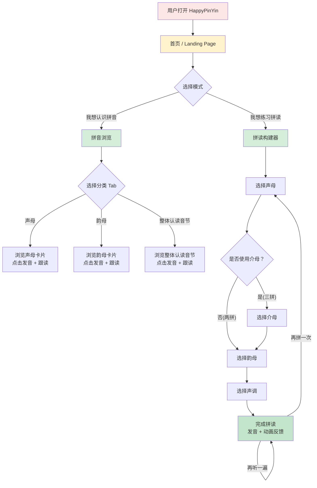
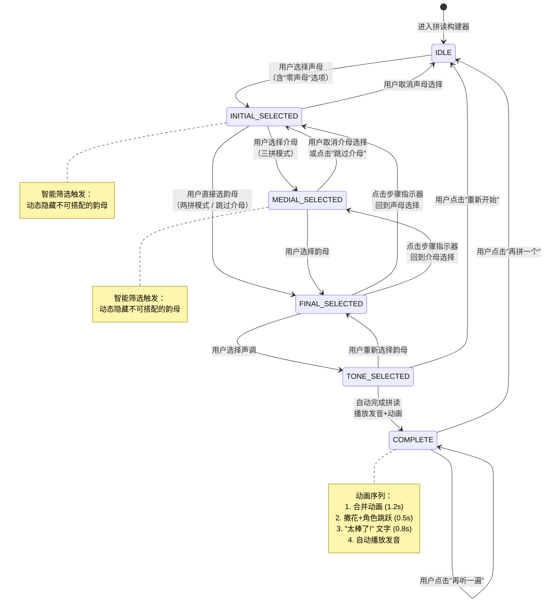
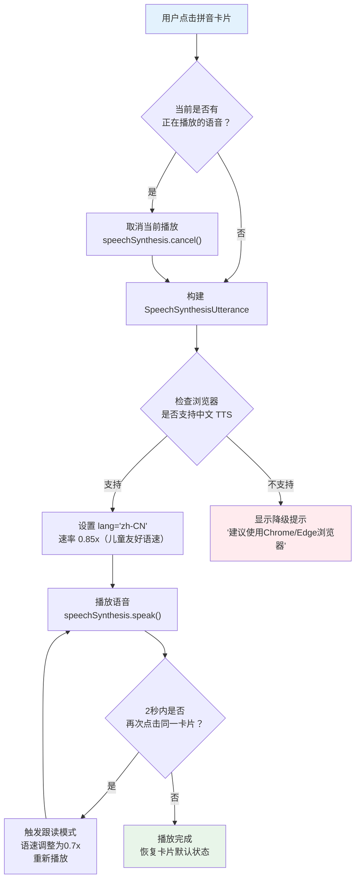
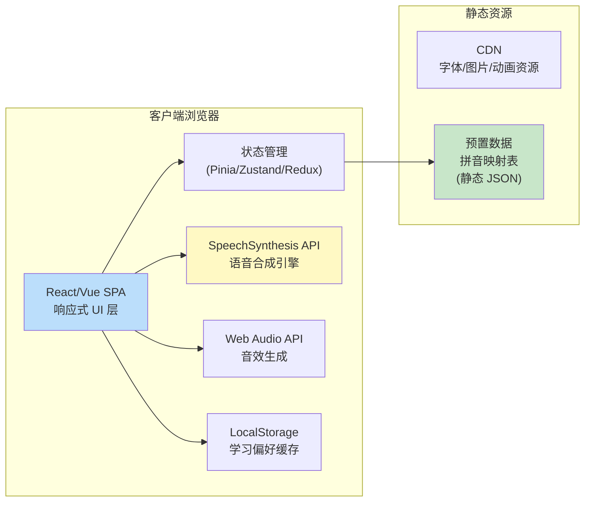

# HappyPinYin（快乐拼音）产品需求文档

**文档版本**: v1.1
**创建日期**: 2026-06-04
**文档状态**: 已更新
**最后更新**: 2026-06-05 — 新增游戏模块（拼音泡泡乐），详见 [游戏 PRD](./game-requirements.md)

---

## 目录

1. [产品概述](#1-产品概述)
2. [用户分析](#2-用户分析)
3. [功能需求](#3-功能需求)
4. [教学内容规范](#4-教学内容规范)
5. [交互流程](#5-交互流程)
6. [技术架构概要](#6-技术架构概要)
7. [非功能需求](#7-非功能需求)
8. [数据需求](#8-数据需求)
9. [项目成功指标](#9-项目成功指标)
10. [未来规划](#10-未来规划)
11. [附录](#11-附录)

---

## 1. 产品概述

### 1.1 产品愿景

HappyPinYin（快乐拼音）是一款面向 5-8 岁儿童的 Web 端汉语拼音学习工具，以"让每个孩子都能快乐、高效地学会拼音"为使命，通过可视化拼读交互和即时语音反馈，帮助儿童在趣味互动中掌握汉语拼音的认读和拼读能力。

### 1.2 核心价值主张

| 维度 | 描述 |
|------|------|
| **教育价值** | 严格遵循人教版/部编版小学语文教材拼音教学大纲，确保内容权威性和教学连贯性 |
| **交互价值** | 通过"选择-组合-发声"的拼读构建器，将抽象的拼音规则具象化为可操作的积木式拼搭体验 |
| **情感价值** | 正向反馈动画、学习伙伴角色和糖果色视觉风格，降低学习焦虑，建立学习信心 |
| **便捷价值** | 浏览器即开即用，无需安装，PC/平板/手机全平台自适应，覆盖家庭和课堂双场景 |

### 1.3 产品目标（SMART 原则）

| 目标 | 指标 | 目标值 | 时间框架 |
|------|------|--------|----------|
| **学习有效性** | 用户完成一次完整拼读流程的比例 | >= 80% | 上线后 1 个月 |
| **用户留存** | 周活跃用户回访率 | >= 50% | 上线后 1 个月 |
| **内容覆盖** | 教材拼音大纲覆盖率 | 100%（63 个拼音元素） | MVP 上线 |
| **技术可用性** | 首屏加载时间 (LCP) | < 2s (4G 网络) | MVP 上线 |
| **无障碍** | 触控目标尺寸合规率 | 100%（>=48px） | MVP 上线 |

---

## 2. 用户分析

### 2.1 用户画像

#### 主要用户：小朋友（5-8 岁）

**Persona: 乐乐（6 岁，幼儿园大班）**

- **认知水平**: 认识大部分字母形状，但尚未建立拼音和发音的系统性联系
- **行为特点**: 注意力持续时间 8-15 分钟，容易被色彩和动画吸引，喜欢重复操作熟悉的内容
- **操作能力**: 能用手指在平板上进行点选、拖拽，但精细操作能力有限；PC 端鼠标操作逐渐熟练
- **情感需求**: 需要即时正向反馈（音效+动画），害怕犯错，遇到困难容易放弃
- **语言环境**: 家庭使用普通话，父母有辅导意愿但方法不一定专业

**JTBD (Jobs-to-Be-Done)**:
- 当我看到一个拼音字母时，我想知道它怎么读，建立"形状→发音"的联系
- 当我想拼出一个音节时，我希望能像搭积木一样把声母和韵母拼在一起，并立刻听到正确的发音示范
- 当我在学校学了新的拼音，我想回家后能自己练习和复习

#### 次要用户：家长/老师（25-40 岁）

**Persona: 乐乐妈妈（34 岁，职场家长）**

- **需求**: 希望有专业的工具辅助孩子学习拼音，弥补自己拼音发音不标准的问题
- **使用方式**: 陪伴学习为主，偶尔让孩子独立操作；需要了解孩子的学习进度
- **关注点**: 发音是否标准（普通话等级）、内容是否与学校教材一致

**Persona: 王老师（28 岁，小学一年级语文教师）**

- **需求**: 需要课堂演示工具，能在大屏幕上清晰展示拼音结构和拼读过程
- **使用方式**: 课堂集体教学使用投影/大屏交互，重点使用拼读构建器演示
- **关注点**: 内容规范性、声调标注准确性、操作流畅度

### 2.2 用户痛点与解决方案

| 痛点 | 现状 | HappyPinYin 解决方案 |
|------|------|----------------------|
| **发音不标准** | 家长发音受方言影响，教错后纠正成本高 | 基于标准普通话语音的 TTS 引擎，提供标准发音示范 |
| **拼读规则抽象** | 声母韵母的搭配规则对儿童来说纯靠记忆 | 智能筛选韵母，只显示合法组合，在操作中自然习得规则 |
| **学习枯燥** | 传统拼音卡片和描红本缺乏互动性 | 可视化拼读过程+正向反馈动画+学习伙伴角色 |
| **家长无从下手** | 不知从何教起、不知教学顺序 | 按教材大纲组织内容，提供自然的递进式浏览和拼读路径 |
| **设备限制** | 专门的学习 App 需要安装和更新 | 纯 Web 应用，浏览器打开即用，跨平台自适应 |

### 2.3 使用场景

| 场景 | 用户 | 设备 | 行为描述 |
|------|------|------|----------|
| **家庭陪学** | 家长+孩子 | iPad/平板 | 家长引导孩子浏览拼音表，点击发音后鼓励跟读；使用拼读构建器一起拼出当天学校学过的音节 |
| **自主探索** | 孩子独自 | iPad/平板 | 孩子自己打开应用，随意点击字母听发音，尝试拼出自己名字的拼音 |
| **课堂演示** | 老师 | PC+投影/大屏 | 老师在课堂上展示拼读过程，全班跟读；使用拼读构建器演示声母+韵母的组合规则 |
| **碎片练习** | 孩子+家长 | 手机 | 外出就餐等待时，快速打开浏览器访问，进行 5 分钟拼读练习 |

---

## 3. 功能需求

### 3.1 功能优先级总览

| 优先级 | 定义 | 功能项 |
|--------|------|--------|
| **P0 (Must Have)** | MVP 必须上线，缺一不可 | 拼音浏览（声母/韵母/整体认读音节展示+点击发音）、拼读构建器（基础两拼流程+智能筛选+声调选择+发音）、响应式布局 |
| **P1 (Should Have)** | MVP 建议包含，可接受简化版 | 三拼流程（含介母）、拼读过程可视化动画、学习伙伴角色（小熊猫）、拼读成功正向反馈动画、拼音泡泡乐游戏（听音识拼音） |
| **P2 (Nice to Have)** | MVP 后迭代 | 跟读录音评测、积分勋章系统、学习进度追踪、家长/教师模式 |

### 3.2 功能一：拼音浏览 (P0)

#### 3.2.1 功能描述

提供一个分类清晰、视觉友好的拼音浏览页面，展示全部 63 个拼音元素（23 声母 + 24 韵母 + 16 整体认读音节）。用户点击任意拼音卡片，浏览器通过 SpeechSynthesis API 发出标准普通话读音。

#### 3.2.2 用户故事

- **US-BR-01**: 作为小朋友，我想要看到所有声母的卡片展示，并能点击任意一个听它怎么读，这样我就能认识和记住声母的发音。
- **US-BR-02**: 作为小朋友，我想要看到韵母按类别分开展示（单韵母和复韵母），点击后能听到清晰的发音，这样我就能区分不同类型的韵母。
- **US-BR-03**: 作为小朋友，我想要看到整体认读音节的列表，点击能听到完整的音节读音，这样我就能了解哪些音节不需要拼读。
- **US-BR-04**: 作为小朋友，点击卡片听到发音后，我想跟着再读一遍（跟读模式），应用能帮我再播放一次发音示范。
- **US-BR-05**: 作为老师，我想要在大屏幕上按分类展示拼音元素，卡片足够大、颜色区分清晰，全班同学都能看清。

#### 3.2.3 分类Tab切换展示声母/韵母/整体认读音节

声母 (23个)
b p m f   d t n l
g k h     j q x
zh ch sh r z c s
y w


---

### 拼音浏览

#### 声母

b p m f
d t n l
g k h
j q x
zh ch sh r
z c s
y w

#### 韵母

单韵母: a o e i u ü

复韵母: ai ei ui ao ou iu ie üe er
鼻韵母: an en in un ün ang eng ing ong

#### 整体认读音节

zhi chi shi ri
zi ci si
yi wu yu
ye yue yuan
yin yun ying

---

---

### 拼读构建器

#### 两拼法（基础）

[声母] + [韵母] → [声调] → 完整拼音

例：b + a + 一声 → bā

#### 三拼法（进阶）

[声母] + [介母] + [韵母] → [声调] → 完整拼音

例：g + u + a + 一声 → guā

---

#### 3.2.4 功能详情

**信息架构**

```
拼音浏览
├── 声母 Tab
│   ├── 唇音组: b p m f
│   ├── 舌尖音组: d t n l
│   ├── 舌根音组: g k h
│   ├── 舌面音组: j q x
│   ├── 翘舌音组: zh ch sh r
│   ├── 平舌音组: z c s
│   └── 特殊声母: y w
├── 韵母 Tab
│   ├── 单韵母: a o e i u ü
│   └── 复韵母: ai ei ui ao ou iu ie üe er an en in un ün ang eng ing ong
└── 整体认读音节 Tab
    └── zhi chi shi ri zi ci si yi wu yu ye yue yuan yin yun ying
```

**交互规格**

| 属性 | 规格 |
|------|------|
| 卡片最小触控尺寸 | 64px × 64px (移动端), 56px × 56px (PC端) |
| 卡片间距 | 12px |
| 卡片圆角 | 12px |
| 点击反馈 | 卡片缩放至 95% + 背景色加深 + 0.15s 过渡动画 |
| 发音触发 | 单击卡片触发，连续点击时取消前一次未完成的播放 |
| 播放中状态 | 卡片边框高亮（2px 主色边框）+ 声波动画图标 |
| 跟读模式 | 首次点击→播放发音; 间隔 2s 内再次点击同一卡片→播放较慢速发音（语速 0.7x）供跟读 |
| 分类标签颜色 | 声母=蓝色系, 韵母=粉色系, 整体认读音节=绿色系 |

**声母按发音部位分组展示**，每组有浅色背景区和标签（如"唇音"），增强教育性。分组信息如下：

| 分组名称 | 包含声母 | 卡片主题色 |
|----------|----------|------------|
| 唇音 | b p m f | #FFB3BA (浅粉) |
| 舌尖音 | d t n l | #FFDFBA (浅橙) |
| 舌根音 | g k h | #FFFFBA (浅黄) |
| 舌面音 | j q x | #BAFFC9 (浅绿) |
| 翘舌音 | zh ch sh r | #BAE1FF (浅蓝) |
| 平舌音 | z c s | #E8BAFF (浅紫) |
| 特殊声母 | y w | #D4BAFF (浅紫蓝) |

#### 3.2.5 边界与异常处理

| 场景 | 处理方式 |
|------|----------|
| 浏览器不支持 SpeechSynthesis API | 显示提示"您的浏览器暂不支持发音功能，请使用 Chrome 或 Edge 浏览器"，卡片仍可浏览但不可点击发音 |
| 语音合成队列冲突 | 连续快速点击多个卡片时，调用 `speechSynthesis.cancel()` 取消前次播放，只播放最新的 |
| 语音加载延迟 | 点击后 500ms 内未开始播放，显示加载动画（声波脉动） |
| 移动端自动播放限制 | 首次进入页面时显示"点击开始"引导浮层，用户首次交互后解除浏览器的自动播放限制 |
| 空状态 | 无（内容为静态预置数据） |
| 韵母 "ü" 在部分字体下显示异常 | 指定字体栈中优先使用支持拼音的字体（如 PingFang SC, Microsoft YaHei, Noto Sans SC） |

---

### 3.3 功能二：拼读构建器 (P0 核心功能)

#### 3.3.1 功能描述

拼读构建器是 HappyPinYin 的核心交互模块。用户通过"选择声母→选择介母(可选)→选择韵母→选择声调→完成拼读"的流程，像搭积木一样完成拼音拼读。系统在每个步骤进行智能筛选，确保用户只能拼出合法的汉语拼音音节。

#### 3.3.2 用户故事

- **US-BU-01**: 作为小朋友，我想从声母卡片中选一个声母，然后系统自动只显示能搭配的韵母让我选，这样我就不会拼出不存在的拼音了。
- **US-BU-02**: 作为小朋友，我选好声母和韵母后，想要看到拼读的过程动画（比如 b 和 a 滑到一起变成 ba），这样我就能理解"拼读"是什么意思。
- **US-BU-03**: 作为小朋友，拼出拼音后我想自己选择一声、二声、三声还是四声，然后听到带声调的完整发音。
- **US-BU-04**: 作为老师，我想在课堂上展示某个音节的拼读过程，学生能清楚地看到每一步的组合逻辑。
- **US-BU-05**: 作为小朋友，如果我想拼"家"(jia) 这样的三拼音节，我希望也能通过选择介母 "i" 来完成拼读。

#### 3.3.3 拼读模式

**两拼法（基础模式 - P0）**

适用于声母+韵母直接相拼的音节（如 ba, po, mi, gu, zhi 等）。

```
[选择声母] → [选择韵母] → [选择声调] → 完成拼读 + 播放发音
```

**三拼法（进阶模式 - P1）**

适用于声母+介母+韵母的三拼音节（如 jia, gua, xuan, qiong 等）。

```
[选择声母] → [选择介母(可选)] → [选择韵母] → [选择声调] → 完成拼读 + 播放发音
```

#### 3.3.4 智能筛选规则

系统预置全部合法拼音组合的映射表（详见第 4 章），在每个选择步骤进行动态筛选：

**步骤 1: 选择声母**

显示全部 23 个声母卡片 + "零声母"选项（用于拼读以元音开头的音节如 an, en, yi, wu 等）。

卡片以分组形式展示（同拼音浏览页的分组）。已选中的卡片高亮，其余保持正常状态。

**步骤 2: 选择介母（可选，三拼模式下）**

- P0 基础模式：跳过此步骤，直接进入韵母选择
- P1 进阶模式：显示 3 个介母选项 (i / u / ü) + "无介母(直接拼)"
- 筛选逻辑：
  - 仅显示与当前声母搭配后仍能产生合法音节的介母
  - 例如：选择声母 "b" 后，介母 "i" 可用（可拼出 bian, biao 等），介母 "ü" 不可用
  - 允许多选"跳过介母"，直接进入韵母选择

**步骤 3: 选择韵母**

- 韵母列表根据「声母 + 介母」组合动态筛选
- 筛选示例：
  - 选 b（无介母） → 显示韵母: a, o, i, u（及以这些韵母开头的复韵母如 ai, an, ang, ao, ei, en 等... 需满足合法组合）
  - 选 j（无介母） → 显示韵母: i, ü（及以这些开头的复韵母如 ia, ian, iang, iao, ie, in, ing, iong, ü, üe, ün 等... 满足合法组合）
  - 选 b + 介母 i → 显示韵母: an, ao（因 bian, biao 为合法音节）
  - 选 g + 介母 u → 显示韵母: a, ai, an, ang, o, ei, en, eng（因 gua, guai, guan, guang, guo, gui, gun, gong 为合法音节）
- 不可用的韵母以灰色低透明度显示（不可点击），可用的以正常色显示
- 韵母按单韵母→复韵母分组排列

**步骤 4: 选择声调**

显示 4 个声调选项（单字拼音不存在轻声，仅显示一声至四声）：

| 序号 | 声调名称 | 符号 | 示例 (ma) | 视觉标识 |
|------|----------|------|-----------|----------|
| 1 | 第一声（阴平） | ˉ | mā | 红色平线 |
| 2 | 第二声（阳平） | ˊ | má | 橙色上升线 |
| 3 | 第三声（上声） | ˇ | mǎ | 绿色折线 |
| 4 | 第四声（去声） | ˋ | mà | 蓝色下降线 |

声调选项会根据当前拼读组合的汉字数据进行智能过滤——仅显示该拼读音节存在对应汉字的声调。例如，"bā"有对应汉字"八"，"bà"有对应汉字"爸"，但如果某声调无对应汉字则不显示该声调按钮。

每个声调选项为一个独立按钮，显示该声调的符号和动画演示（例如：一声按钮上有一个从左到右水平移动的发光点，二声有上升动画）。

**步骤 5: 完成拼读**

- 组合公式可视化：例如 `b` + `a` + `ˉ` = **bā**
- 触发拼读成功动画（见 3.3.6）
- 自动播放带声调的完整音节发音
- 显示完整的拼音结果（大字号 + 声调标记）

#### 3.3.5 零声母处理

当用户选择"零声母"时:
- 跳过节母选择步骤（零声母音节不存在三拼）
- 韵母列表显示所有可作为零声母音节韵母的选项：a, o, e, ai, ei, ao, ou, an, en, ang, eng, er, yi, ya, ye, yao, you, yan, yin, yang, ying, yong, wu, wa, wo, wai, wei, wan, wen, wang, weng, yu, yue, yuan, yun

#### 3.3.6 视觉反馈设计

**拼读过程可视化动画**

```
[声母卡片] --滑动合并--> [韵母卡片] --声调标记出现--> [完整拼音结果]
     b                        a                       bā
```

动画规格:
- 动画时长: 1.2s（声母+韵母合并 0.6s + 声调标记弹入 0.3s + 结果放大 0.3s）
- 缓动函数: ease-in-out
- 两个选中卡片从两侧向中心滑入并合并，背景色融合为主题渐变色
- 声调标记以弹跳动画出现在韵母上方
- 最终结果卡片放大 120% + 光晕效果

**拼读成功正向反馈**

播放顺序（总时长约 2s）:
1. **撒花动画** (0.5s): 从结果卡片周围爆发 8-12 个彩色小圆点（糖果色），向外扩散并逐渐消失
2. **学习伙伴跳跃** (0.5s): 小熊猫角色在卡片旁边做出跳跃+拍手动作
3. **音效** (同步): 清脆的"叮咚"成功音效（使用 Web Audio API 生成，避免加载延迟）
4. **"太棒了!"文字** (0.8s): 结果卡片上方弹出鼓励文字，渐显后上飘消失

**可重播**: 拼读完成后，结果卡片旁显示"再听一遍"按钮（喇叭图标），点击可以重新播放发音。
**可重拼**: 结果卡片旁显示"重新拼"按钮，点击清空所有选择回到步骤 1。

#### 3.3.7 选择器交互规格

```
┌──────────────────────────────────────────────────────────┐
│  步骤指示器:  [声母] ──→ [介母(可选)] ──→ [韵母] ──→ [声调]  │
│              (已完成绿色勾) (当前高亮)  (待选灰色)           │
├──────────────────────────────────────────────────────────┤
│                                                          │
│  ┌─────┐ ┌─────┐ ┌─────┐ ┌─────┐                        │
│  │  b  │ │  p  │ │  m  │ │  f  │  ← 声母选择区           │
│  └─────┘ └─────┘ └─────┘ └─────┘                        │
│  ┌─────┐ ┌─────┐ ┌─────┐ ┌─────┐                        │
│  │  d  │ │  t  │ │  n  │ │  l  │                        │
│  └─────┘ └─────┘ └─────┘ └─────┘                        │
│  ...                                                     │
│                                                          │
├──────────────────────────────────────────────────────────┤
│  已选: [b] + [?] → [?]                                   │
│  预览区（实时显示当前选择进度）                              │
├──────────────────────────────────────────────────────────┤
│                                                          │
│  不可用韵母（灰色）:  ü  e                                │
│  可用韵母（彩色）: a o i u 及复韵母...                     │
│                                                          │
└──────────────────────────────────────────────────────────┘
```

**步骤指示器**: 位于选择区顶部，显示当前处于哪个步骤。已完成步骤显示绿色勾，当前步骤高亮脉动，未到步骤灰色。

**预览区**: 位于选择区和选择项之间，实时显示已选择的元素组合公式，如 `[b] + [_] → ?`，随着选择逐渐填充。

**返回操作**: 点击步骤指示器中的已完成的步骤可回退（例如选完韵母后点击声母步骤，可重新选择声母，同时清空后续选择）。

#### 3.3.8 边界与异常处理

| 场景 | 处理方式 |
|------|----------|
| 选择的组合产生不存在的音节（数据异常） | 不可能发生：数据映射保证只显示合法组合；若因数据错误出现，显示友好提示"这个组合还在学习中～"并回退到上一步 |
| 用户在移动端横屏操作 | 响应式布局自动适配，选择区卡片重新排列为合适的行列数 |
| 未选择声调直接点"发音" | 声调步骤为必选，发音按钮在选择声调后才可用；完成韵母选择后自动推进到声调选择 |
| 某声调无对应汉字 | 智能过滤：系统自动隐藏无对应汉字的声调选项，仅显示有数据的声调按钮 |
| 连续重复拼读同一音节 | 每次拼读完成后保留结果，用户点击"再拼一次"才会重置，避免误触导致丢失 |

---

### 3.4 功能三：学习伙伴角色 (P1)

#### 3.4.1 功能描述

引入一个可爱的学习伙伴角色——"拼拼"（一只小熊猫），全程陪伴孩子的拼音学习之旅。拼拼会根据用户的操作给出表情、动作和文字提示。

#### 3.4.2 角色设定

| 属性 | 设定 |
|------|------|
| 名称 | 拼拼（PingPing） |
| 形象 | 小熊猫（红色小熊猫/Red Panda），圆滚滚的身体，大大的眼睛 |
| 性格 | 活泼、友善、耐心，偶尔犯个小迷糊 |
| 位置 | 固定于页面右下角（移动端）/ 右侧栏（PC 端） |

#### 3.4.3 拼拼的行为状态

| 用户操作/情景 | 拼拼的表现 | 提示文字示例 |
|--------------|-----------|-------------|
| 刚进入页面（idle） | 挥手打招呼 | "你好呀！我是拼拼，一起来学拼音吧！" |
| 用户停留超过 15s 未操作 | 打哈欠/眨眼睛 | "选一个声母开始拼读吧～" |
| 用户选了一个声母 | 点头 + 竖起大拇指 | "选得好！接下来选韵母吧！" |
| 用户完成拼读 | 跳跃 + 拍手 + 撒花 | "太棒了！你拼出了 bā！" |
| 用户点击了不可用的韵母（灰色） | 摇头 | "这个声母和韵母不能拼在一起哦，试试其他的！" |
| 用户拼错了 3 次以上 | 给出提示，指向正确的韵母 | "试试这个呢？它和 b 是好朋友！" |
| 用户连续完成 5 次拼读 | 兴奋转圈 | "你真厉害！已经是第 5 个拼音啦！" |

#### 3.4.4 实现要点

- 使用 CSS Sprite 动画或 Lottie JSON 动画实现角色的动作表现
- 提示文字以气泡框形式出现在角色上方
- 角色动画帧率 >= 12fps，确保动作流畅
- 音频反馈与角色动作时间轴对齐（跳跃和"叮咚"音效同步）

---

### 3.5 功能四：练习/测试模块 (P2)

（MVP 后迭代，此处简要描述）

- **听音选拼音**: 播放一个音节发音，用户从 4 个选项中选出正确的拼音
- **看拼音选声调**: 给出拼音字母组合（如 "ba"），用户选择正确的声调
- **拼读填空**: 给出声母和韵母，用户拖动或选择正确的组合完成拼读
- **学习报告**: 记录用户每次练习的正确率、薄弱拼音，生成可视化报告

---

### 3.6 功能五：游戏化系统 (P2)

（MVP 后迭代，此处简要描述）

- **积分机制**: 每完成一次拼读 +10 分，连续正确拼读有额外加分
- **成就勋章**: 收集类勋章（如"声母达人"：认识全部 23 个声母）
- **每日挑战**: 每天 3 个推荐音节，完成挑战获得额外积分
- **排行榜**: 不设计公开排行榜（避免儿童之间的负面比较），改为"和自己比"的进度条

---

## 4. 教学内容规范

### 4.1 完整拼音元素表

#### 4.1.1 声母表（23 个）

| 序号 | 声母 | 发音部位分组 | 国际音标(IPA) | 呼读音 |
|------|------|-------------|---------------|--------|
| 1 | b | 唇音 | [p] | bo |
| 2 | p | 唇音 | [pʰ] | po |
| 3 | m | 唇音 | [m] | mo |
| 4 | f | 唇音 | [f] | fo |
| 5 | d | 舌尖音 | [t] | de |
| 6 | t | 舌尖音 | [tʰ] | te |
| 7 | n | 舌尖音 | [n] | ne |
| 8 | l | 舌尖音 | [l] | le |
| 9 | g | 舌根音 | [k] | ge |
| 10 | k | 舌根音 | [kʰ] | ke |
| 11 | h | 舌根音 | [x] | he |
| 12 | j | 舌面音 | [tɕ] | ji |
| 13 | q | 舌面音 | [tɕʰ] | qi |
| 14 | x | 舌面音 | [ɕ] | xi |
| 15 | zh | 翘舌音 | [tʂ] | zhi |
| 16 | ch | 翘舌音 | [tʂʰ] | chi |
| 17 | sh | 翘舌音 | [ʂ] | shi |
| 18 | r | 翘舌音 | [ʐ] | ri |
| 19 | z | 平舌音 | [ts] | zi |
| 20 | c | 平舌音 | [tsʰ] | ci |
| 21 | s | 平舌音 | [s] | si |
| 22 | y | 特殊 | [j] | yi |
| 23 | w | 特殊 | [w] | wu |

#### 4.1.2 韵母表（24 个）

**单韵母（6 个）**

| 序号 | 韵母 | 国际音标(IPA) |
|------|------|---------------|
| 1 | a | [a] |
| 2 | o | [o] |
| 3 | e | [ɤ] |
| 4 | i | [i] |
| 5 | u | [u] |
| 6 | ü | [y] |

**复韵母（18 个）**

| 序号 | 韵母 | 子类 | 国际音标(IPA) |
|------|------|------|---------------|
| 7 | ai | 前响复韵母 | [ai] |
| 8 | ei | 前响复韵母 | [ei] |
| 9 | ui | 中响复韵母 | [uei] |
| 10 | ao | 前响复韵母 | [au] |
| 11 | ou | 前响复韵母 | [ou] |
| 12 | iu | 中响复韵母 | [iou] |
| 13 | ie | 后响复韵母 | [ie] |
| 14 | üe | 后响复韵母 | [ye] |
| 15 | er | 特殊韵母 | [ɚ] |
| 16 | an | 前鼻韵母 | [an] |
| 17 | en | 前鼻韵母 | [ən] |
| 18 | in | 前鼻韵母 | [in] |
| 19 | un | 前鼻韵母 | [uən] |
| 20 | ün | 前鼻韵母 | [yn] |
| 21 | ang | 后鼻韵母 | [aŋ] |
| 22 | eng | 后鼻韵母 | [əŋ] |
| 23 | ing | 后鼻韵母 | [iŋ] |
| 24 | ong | 后鼻韵母 | [uŋ] |

#### 4.1.3 整体认读音节表（16 个）

| 序号 | 音节 | 构成说明 |
|------|------|----------|
| 1 | zhi | zh + i (整体认读) |
| 2 | chi | ch + i (整体认读) |
| 3 | shi | sh + i (整体认读) |
| 4 | ri | r + i (整体认读) |
| 5 | zi | z + i (整体认读) |
| 6 | ci | c + i (整体认读) |
| 7 | si | s + i (整体认读) |
| 8 | yi | y + i (整体认读) |
| 9 | wu | w + u (整体认读) |
| 10 | yu | y + ü (整体认读, ü 去两点) |
| 11 | ye | y + ê (整体认读) |
| 12 | yue | y + üe (整体认读, ü 去两点) |
| 13 | yuan | y + üan (整体认读, ü 去两点) |
| 14 | yin | y + in (整体认读) |
| 15 | yun | y + ün (整体认读, ü 去两点) |
| 16 | ying | y + ing (整体认读) |

### 4.2 拼音组合规则（声母+韵母合法性映射表）

以下定义每个声母可以与之组合的韵母集合。此映射表直接用于拼读构建器的智能筛选逻辑。

```
声母组合规则（基础单韵母原则，复韵母遵循同样模式）:

b: a, o, i, u        (不可拼: e, ü)
p: a, o, i, u        (不可拼: e, ü)
m: a, o, e, i, u     (不可拼: ü)
f: a, o, u           (不可拼: e, i, ü)
d: a, e, i, u        (不可拼: o, ü)
t: a, e, i, u        (不可拼: o, ü)
n: a, e, i, u, ü     (全可拼)
l: a, e, i, u, ü     (全可拼)
g: a, e, u           (不可拼: o, i, ü)
k: a, e, u           (不可拼: o, i, ü)
h: a, e, u           (不可拼: o, i, ü)
j: i, ü              (只可拼 i, ü)
q: i, ü              (只可拼 i, ü)
x: i, ü              (只可拼 i, ü)
zh: a, e, i(整体认读), u  (不可拼: o, ü)
ch: a, e, i(整体认读), u  (不可拼: o, ü)
sh: a, e, i(整体认读), u  (不可拼: o, ü)
r: e, i(整体认读), u     (不可拼: a, o, ü)
z: a, e, i(整体认读), u  (不可拼: o, ü)
c: a, e, i(整体认读), u  (不可拼: o, ü)
s: a, e, i(整体认读), u  (不可拼: o, ü)
y: i(整体认读), a, e(整体认读), u(整体认读), ü/u(整体认读) — 整体认读为主
w: u(整体认读), a, o    — 整体认读为主
```

**关键规则详解**:

1. **b, p, m, f 与 o 的组合**: 直接拼写为 bo, po, mo, fo（注意不是 buo, puo, muo, fuo）
2. **j, q, x 与 ü 的组合**: 拼写时 ü 上的两点省略，写作 ju, qu, xu（发音仍为 [tɕy], [tɕʰy], [ɕy]）
3. **j, q, x 与 üe/ün/üan 的组合**: 拼写为 jue, jun, juan（ü 上两点省略）
4. **y 与 ü 的组合**: 拼写为 yu（ü 上两点省略），包含 yue, yuan, yun
5. **翘舌音 zh, ch, sh, r 的 -i**: 这里的 "i" 不是常规的 i[ɻ̩]，而是舌尖后元音 [ɻ̩]，属于整体认读音节
6. **平舌音 z, c, s 的 -i**: 这里的 "i" 是舌尖前元音 [ɯ]，属于整体认读音节
7. **er 韵母**: 只能自成音节（零声母），不与其他声母相拼。常见例: ér (儿), èr (二), ěr (耳)

### 4.3 三拼音节组合规则

三拼音节由声母 + 介母(i/u/ü) + 韵母组成。以下是应用中支持的三拼音节清单:

| 声母 | 介母 i 的组合 | 介母 u 的组合 | 介母 ü 的组合 |
|------|-------------|-------------|-------------|
| b | bian, biao | — | — |
| p | pian, piao | — | — |
| m | mian, miao, miu | — | — |
| d | dian, diao, diu | duan, dui, dun, duo | — |
| t | tian, tiao | tuan, tui, tun, tuo | — |
| n | nian, niang, niao, niu | nuan | nüe |
| l | lian, liang, liao, liu | luan, lun, luo | lüe |
| g | — | gua, guai, guan, guang, gui, gun, guo | — |
| k | — | kua, kuai, kuan, kuang, kui, kun, kuo | — |
| h | — | hua, huai, huan, huang, hui, hun, huo | — |
| j | jia, jian, jiang, jiao, jiong, jiu | — | jue, juan, jun |
| q | qia, qian, qiang, qiao, qiong, qiu | — | que, quan, qun |
| x | xia, xian, xiang, xiao, xiong, xiu | — | xue, xuan, xun |
| zh | — | zhua, zhuai, zhuan, zhuang, zhui, zhun, zhuo | — |
| ch | — | chua, chuai, chuan, chuang, chui, chun, chuo | — |
| sh | — | shua, shuai, shuan, shuang, shui, shun, shuo | — |
| r | — | ruan, rui, run, ruo | — |
| z | — | zuan, zui, zun, zuo | — |
| c | — | cuan, cui, cun, cuo | — |
| s | — | suan, sui, sun, suo | — |

### 4.4 拼音助记词规范

为帮助儿童建立"形状→发音→生活场景"的三重联系，每个拼音元素均配备形象化的助记词（description 字段），展示在拼音卡片上。

**声母助记词示例**: b → "听广播的b", p → "爬山坡的p", j → "小公鸡的j"

**单韵母助记词**: a → "张大嘴巴a a a", o → "公鸡打鸣o o o", e → "白鹅倒影e e e", i → "一件衣服i i i", u → "一只乌鸦u u u", ü → "一条小鱼ü ü ü"

**复韵母助记词**: ai → "挨在一起ai ai ai", ei → "用力砍柴ei ei ei", ui → "围巾围巾ui ui ui", ao → "冬天棉袄ao ao ao", ou → "海鸥飞翔ou ou ou", iu → "一张邮票iu iu iu", ie → "椰子树叶ie ie ie", üe → "月儿弯弯üe üe üe", er → "一只耳朵er er er", an → "安全第一an an an", en → "摁下门铃en en en", in → "美妙声音in in in", un → "温暖春天un un un", ün → "云朵飘飘ün ün ün", ang → "昂首挺胸ang ang ang", eng → "一盏台灯eng eng eng", ing → "一只老鹰ing ing ing", ong → "闹钟叮咚ong ong ong"

**整体认读音节助记词**: zhi → "织毛衣的zhi", chi → "吃东西的chi", shi → "大狮子的shi", ri → "红日出的ri", zi → "学写字的zi", ci → "小刺猬的ci", si → "蚕吐丝的si", yi → "新衣服的yi", wu → "小房屋的wu", yu → "小金鱼的yu", ye → "树叶子的ye", yue → "弯月亮的yue", yuan → "圆又圆的yuan", yin → "好声音的yin", yun → "白云朵的yun", ying → "老鹰飞的ying"

### 4.5 拼音书写规则（ü 上两点省略规则）

| 规则 | 说明 | 示例 |
|------|------|------|
| j/q/x + ü | ü 上两点省略，写作 ju/qu/xu | j + ü → ju |
| y + ü | ü 上两点省略，写作 yu | y + ü → yu |
| j/q/x + üe | ü 上两点省略，写作 jue/que/xue | j + üe → jue |
| n/l + ü | ü 上两点保留，写作 nü/lü | n + ü → nü |
| y + üe/ün/üan | ü 上两点省略 | y + üe → yue, y + üan → yuan, y + ün → yun |

**对拼读构建器的影响**:
- 在"选择韵母"步骤中，ü 类韵母始终显示为带两点的形式（ü, üe, ün, üan），以帮助儿童认识韵母本来的模样
- 在"完成拼读"展示结果时，根据规则自动处理两点的省略（ju 而非 jü, yu 而非 yü）
- 同时在结果卡片上以轻提示展示规则："j 和 ü 在一起，两点要藏起来哦～"

---

## 5. 交互流程

### 5.1 全局导航流程



### 5.2 拼读构建器状态机



### 5.3 拼音浏览发音流程



### 5.4 首页布局线框图（概要）

```
┌──────────────────────────────────────────────────┐
│   🐼 快乐拼音  HappyPinYin                       │
├──────────────────────────────────────────────────┤
│                                                  │
│     ┌─────────────────┐  ┌─────────────────┐    │
│     │                 │  │                 │    │
│     │   📖 拼音浏览   │  │   🧩 拼读构建器  │    │
│     │                 │  │                 │    │
│     │  认识声母韵母   │  │  动手拼一拼     │    │
│     │  点击听发音     │  │  声母+韵母→拼音 │    │
│     │                 │  │                 │    │
│     └─────────────────┘  └─────────────────┘    │
│                                                  │
│                   ┌──────────┐                   │
│                   │  🐼 拼拼  │                   │
│                   │  "来吧!"  │                   │
│                   └──────────┘                   │
│                                                  │
└──────────────────────────────────────────────────┘
```

---

## 6. 技术架构概要

### 6.1 整体架构



### 6.2 技术选型建议

| 层 | 推荐方案 | 备选方案 | 选型理由 |
|----|----------|----------|----------|
| 前端框架 | React 18+ | Vue 3 | React 生态成熟，Lottie/动画库支持好 |
| 构建工具 | Vite | — | 快速 HMR，开发体验佳 |
| 状态管理 | Zustand | Pinia (Vue) | 轻量，适合中等复杂度应用 |
| 样式方案 | Tailwind CSS + CSS Modules | Styled Components | 原子化开发效率高，自定义组件用 CSS Modules |
| 语音合成 | Web Speech API (SpeechSynthesis) | 预录音频 | 无需服务端，零成本，覆盖主流浏览器 |
| 动画引擎 | Lottie-web + CSS Animations | Framer Motion | Lottie 处理角色动画，CSS 处理 UI 过渡 |
| 部署方案 | Vercel / Netlify | Cloudflare Pages | 免费额度充裕，自动 HTTPS，全球 CDN |
| 字体方案 | 系统字体栈 + Google Fonts (Noto Sans SC) | 自托管字体 | 减小首屏加载，系统字体零延迟 |

### 6.3 浏览器兼容性

| 浏览器 | 最低版本 | SpeechSynthesis 支持 | 备注 |
|--------|----------|---------------------|------|
| Chrome | 90+ | 完全支持 | 中文语音质量最佳，推荐首选 |
| Edge | 90+ | 完全支持 | 与 Chrome 相同内核 |
| Safari | 14.1+ | 部分支持 | iOS Safari 中文语音可用，需用户手势触发 |
| Firefox | 88+ | 部分支持 | 中文语音需系统安装语音包 |
| 三星浏览器 | 15+ | 基本支持 | Android WebView 内核 |

### 6.4 第三方依赖

| 依赖 | 用途 | 许可证 |
|------|------|--------|
| SpeechSynthesis API | 拼音发音 | 浏览器原生 API |
| Web Audio API | 音效生成 | 浏览器原生 API |
| Lottie-web / dotLottie | 角色动画播放 | MIT |
| canvas-confetti | 撒花/粒子特效 | ISC |
| 字体: Noto Sans SC | 韵母 ü 正确渲染 | OFL |

---

## 7. 非功能需求

### 7.1 性能要求

| 指标 | 目标值 | 测量方法 |
|------|--------|----------|
| LCP (Largest Contentful Paint) | < 2.0s (4G) | Lighthouse / Web Vitals |
| FID (First Input Delay) | < 100ms | Lighthouse / Web Vitals |
| CLS (Cumulative Layout Shift) | < 0.1 | Lighthouse / Web Vitals |
| TTI (Time to Interactive) | < 3.0s (4G) | Lighthouse |
| 语音播放延迟 (点击到发声) | < 300ms | 手动测量 (Performance API) |
| 动画帧率 | >= 30fps (移动端) | Chrome DevTools FPS Meter |
| 总打包体积 (gzip) | < 500KB | 构建分析工具 |

### 7.2 兼容性要求

| 维度 | 要求 |
|------|------|
| 浏览器 | Chrome 90+, Edge 90+, Safari 14.1+, Firefox 88+ |
| 操作系统 | Windows 10+, macOS 11+, iOS 14+, Android 10+ |
| 屏幕分辨率 | 360px (最小) ~ 2560px (最大) 响应式适配 |
| 输入方式 | 触摸 (主要)、鼠标 (次要)、键盘 (辅助，Tab 导航) |

### 7.3 可访问性 (Accessibility / a11y)

| 要求 | 实现方式 |
|------|----------|
| WCAG 2.1 Level AA 合规 | 颜色对比度 >= 4.5:1 (文本) / >= 3:1 (大文本) |
| 键盘导航 | 所有交互元素可通过 Tab 键访问，Enter/Space 激活 |
| 屏幕阅读器支持 | 拼音卡片添加 aria-label (如 "声母 b，读作 bo") |
| 焦点指示器 | 所有可交互元素有可见的 focus ring (3px 蓝色边框) |
| 非颜色区分 | 拼音分类不可仅依赖颜色区分，同时使用标签文字和图标 |
| 触控目标 | 所有可点击元素最小 48px × 48px (WCAG 2.1 要求) |
| 动画控制 | 尊重 `prefers-reduced-motion` 媒体查询，减少/关闭动画 |

### 7.4 安全性

| 方面 | 措施 |
|------|------|
| 内容安全 | 无用户生成内容 (UGC)，无 XSS 风险入口 |
| 数据传输 | MVP 阶段无服务端，纯前端静态应用，无网络传输敏感数据 |
| 第三方依赖 | 通过 npm audit 检查已知漏洞；使用 SRI (Subresource Integrity) 校验 CDN 资源 |
| 隐私保护 | 不收集用户个人信息；LocalStorage 仅存储非 PII 的用户偏好 (如最近浏览的 Tab) |
| CSP 策略 | 设置 Content-Security-Policy 头限制脚本来源 |

### 7.5 可用性 (Usability)

| 原则 | 实现 |
|------|------|
| 容错性 | 选择操作可随时回退（点击步骤指示器）；误操作有撤销路径 |
| 反馈及时性 | 所有点击操作在 100ms 内给出视觉反馈（按钮状态变化） |
| 一致性 | 所有拼音卡片遵循统一的尺寸、圆角、交互逻辑 |
| 简洁性 | 每个页面/步骤只呈现当前任务相关的元素，减少认知负荷 |
| 提示可见性 | 关键操作（如"选一个声母开始吧"）的提示文字高对比度，位置固定 |

---

## 8. 数据需求

### 8.1 预置数据结构

以下数据在构建时静态打包，不需要后端服务。

#### 8.1.1 拼音元素定义

```typescript
// 拼音元素基础模型
interface PinyinElement {
  id: string;           // 唯一标识，如 "initial_b", "final_a", "whole_zhi"
  type: 'initial' | 'final' | 'whole';  // 声母 | 韵母 | 整体认读音节
  pinyin: string;       // 拼音字母，如 "b", "a", "zhi"
  ipa?: string;         // 国际音标(可选)，如 "[p]"
  group: string;        // 分组标签，如 "唇音", "单韵母", "翘舌音"
  displayName?: string; // 呼读音/展示名，如声母 b 显示为 "b"，呼读为 "bo"
  color: string;        // 主题色 hex，如 "#FFB3BA"
  description?: string; // 教学提示文本
}
```

#### 8.1.2 拼读组合规则定义

```typescript
// 合法的声母+韵母组合映射
// Key: 声母 id, Value: 可搭配韵母 id 列表
type InitialFinalMap = Record<string, string[]>;

// 示例:
// {
//   "initial_b": ["final_a", "final_o", "final_i", "final_u", "final_ai", "final_an", "final_ang", "final_ao", "final_ei", "final_en", "final_eng", "final_ie", "final_in", "final_ing"],
//   "initial_j": ["final_i", "final_ü", "final_ia", "final_ian", "final_iang", "final_iao", "final_ie", "final_in", "final_ing", "final_iong", "final_iu", "final_üe", "final_ün", "final_üan"],
//   ...
// }
```

#### 8.1.3 三拼音节组合规则定义

```typescript
// 合法的声母+介母+韵母三拼组合
interface TripleCombination {
  initial: string;  // 声母 id
  medial: 'i' | 'u' | 'ü';  // 介母
  final: string;    // 韵母 id
  result: string;   // 完整拼音 (已处理 ü 省略)
  toneMarks: string[]; // 四个声调的带调拼音: ["jiā", "jiá", "jiǎ", "jià"]
}

// 示例:
// {
//   initial: "initial_j",
//   medial: "i",
//   final: "final_a",
//   result: "jia",
//   toneMarks: ["jiā", "jiá", "jiǎ", "jià"]
// }
```

#### 8.1.4 声调处理

```typescript
// 声调映射表 — 显示每个韵母字母加声调后的样子
// 用于在完成拼读时，给韵母加上正确的声调标记
const TONE_MAP: Record<string, string[]> = {
  'a':  ['ā', 'á', 'ǎ', 'à'],
  'o':  ['ō', 'ó', 'ǒ', 'ò'],
  'e':  ['ē', 'é', 'ě', 'è'],
  'i':  ['ī', 'í', 'ǐ', 'ì'],
  'u':  ['ū', 'ú', 'ǔ', 'ù'],
  'ü':  ['ǖ', 'ǘ', 'ǚ', 'ǜ'],
  // 双元音的声调标在主要元音上
  // ai → āi, ái, ǎi, ài (标在 a 上)
  // ei → ēi, éi, ěi, èi (标在 e 上)
  // ui → uī, uí, uǐ, uì (标在 i 上)
  // ao → āo, áo, ǎo, ào (标在 a 上)
  // iu → iū, iú, iǔ, iù (标在 u 上)
  // ...
};

// 声调标注规则:
// 1. 有 a 标 a 上 (如: bāi, guān)
// 2. 没 a 找 o, e (如: gòu, měi)
// 3. i, u 并列标在后 (如: huì, liú)
// 4. 单个元音直接标 (如: bǐ, gē)
```

### 8.2 客户端存储

MVP 阶段使用 `localStorage` 存储以下非敏感数据：

| 存储 Key | 数据类型 | 用途 | 默认值 |
|----------|----------|------|--------|
| `hp_last_tab` | string | 拼音浏览上次查看的 Tab | `"initials"` |
| `hp_builder_mode` | string | 拼读构建器模式 (2-pin / 3-pin) | `"2-pin"` |
| `hp_audio_enabled` | boolean | 音效开关 | `true` |
| `hp_theme_preference` | string | 主题偏好（预留） | `"default"` |
| `hp_recent_pinyin` | string[] (最多 20) | 最近拼读的音节（供复习） | `[]` |

### 8.3 分析埋点（可选，P2）

若后续需要数据分析，建议设计以下事件：

| 事件名 | 触发时机 | 属性 |
|--------|----------|------|
| `pinyin_browse_click` | 点击拼音浏览卡片 | pinyin_id, pinyin_type |
| `builder_start` | 开始拼读 | mode (2-pin/3-pin) |
| `builder_step_complete` | 完成拼读某一步骤 | step, selected_value, duration_ms |
| `builder_complete` | 完成一次完整拼读 | initial, medial, final, tone, duration_ms |
| `builder_error` | 拼读流程中出现异常 | error_type, current_step |

---

## 9. 项目成功指标

### 9.1 北极星指标 (North Star Metric)

**"每周完成的成功拼读次数"**

这个指标直接反映了产品的核心价值：帮助儿童练习拼音拼读。

### 9.2 AARRR 指标体系

| 阶段 | 指标 | 测量方法 | 目标 (MVP 上线后 1 个月) |
|------|------|----------|--------------------------|
| **Acquisition** | 独立访客数 (UV) | 页面 PV/UV 统计 | 不设硬性目标 (无推广) |
| **Activation** | 首次拼读完成率 | 完成 >=1 次拼读的 UV / 总 UV | >= 60% |
| **Retention** | 周留存率 | 本周回访 UV / 上周活跃 UV | >= 40% |
| **Referral** | 分享率 | 分享行为次数 / 活跃 UV | 不设目标 (MVP 无分享功能) |
| **Revenue** | — | — | MVP 阶段不涉及商业化 |

### 9.3 教学质量指标

| 指标 | 说明 | 目标 |
|------|------|------|
| 拼读成功率 | 用户在选择韵母和声调步骤的成功率（非灰色的选择 = 正确） | 因智能筛选，此指标趋近 100% |
| 平均拼读时长 | 从开始到完成一次拼读的平均时间 | < 30s (熟练后 < 15s) |
| 内容覆盖均匀度 | 各拼音元素的点击/拼读频次分布（避免热门音节过度集中） | 前 10 音节占比 < 40% |

### 9.4 技术质量指标

| 指标 | 目标 |
|------|------|
| 可用性 (Uptime) | >= 99.9% (CDN 层) |
| 错误率 | JS 错误率 < 0.5% |
| 语音播放成功率 | >= 95% (受浏览器兼容性影响) |

---

## 10. 未来规划

### 10.1 迭代路线图

```
Phase 1 (MVP) ──── 4-6 周
├── 拼音浏览 (P0)
├── 拼读构建器 - 两拼模式 (P0)
├── 响应式布局 (P0)
└── 基础动画反馈 (P0)

Phase 2 ──── 4 周
├── 三拼模式 (P1)
├── 学习伙伴角色 - 拼拼 (P1)
├── 拼读过程可视化动画 (P1)
├── 拼读成功正向反馈动画 (P1)
└── 声调标注规则自动处理 (P1)

Phase 3 ──── 6 周
├── 跟读录音评测 (P2)
├── 听音选拼音练习 (P2)
├── 看拼音选声调练习 (P2)
├── 积分与勋章系统 (P2)
└── 学习进度可视化 (P2)

Phase 4 ──── 8 周+
├── 学习报告与推荐 (P2)
├── 家长/教师模式 (P2)
├── 每日挑战 (P2)
├── 离线 PWA 支持
└── 多语言界面 (英文引导)
```

### 10.2 可扩展方向

| 方向 | 描述 | 优先级 |
|------|------|--------|
| PWA 化 | 支持离线使用，添加到主屏幕，提升移动端体验 | 中 |
| 多教材适配 | 支持不同版本教材的拼音教学顺序 | 低 |
| AI 跟读评测 | 使用 Web Audio API 录音 + AI 模型评估发音准确度 | 低（技术成本高） |
| 家校互通 | 老师布置拼读任务，家长查看完成情况 | 低 |
| 国际化 | 面向海外华裔儿童的拼音学习场景（需英文界面） | 低 |

---

## 11. 附录

### 附录 A: 术语表

| 术语 | 拼音 | 英文 | 说明 |
|------|------|------|------|
| 声母 | shēngmǔ | Initial consonant | 汉语音节开头的辅音，共 23 个 |
| 韵母 | yùnmǔ | Final | 汉语音节中声母后面的部分，共 24 个 |
| 单韵母 | dān yùnmǔ | Simple final | 由单个元音构成的韵母，共 6 个 |
| 复韵母 | fù yùnmǔ | Compound final | 由两个或三个元音或元音加鼻辅音构成的韵母，共 18 个 |
| 介母 | jièmǔ | Medial | 介于声母和韵腹之间的元音 (i/u/ü)，也称"韵头" |
| 整体认读音节 | zhěngtǐ rèndú yīnjié | Whole syllable | 不需要拼读、整体认读的音节，共 16 个 |
| 声调 | shēngdiào | Tone | 汉语音节的高低升降变化，共 4 声 + 轻声 |
| 零声母 | líng shēngmǔ | Zero initial | 没有声母、以元音开头的音节 |
| 两拼法 | liǎng pīn fǎ | Two-part spelling | 声母 + 韵母直接相拼的方法 |
| 三拼法 | sān pīn fǎ | Three-part spelling | 声母 + 介母 + 韵母的拼读方法 |

### 附录 B: SpeechSynthesis API 使用要点

```typescript
// 推荐的中文语音配置
const utterance = new SpeechSynthesisUtterance(pinyinText);
utterance.lang = 'zh-CN';
utterance.rate = 0.85;   // 正常语速的 85%，适合儿童
utterance.pitch = 1.0;   // 标准音高
utterance.volume = 1.0;

// 关键注意事项:
// 1. 某些带声调标记的 Unicode 字符 (如 bā) 可能不被 TTS 正确识别
//    建议同时传入纯字母的 fallback (如 "ba")
// 2. Chrome 对于 zh-CN 使用 Microsoft Huihui 或 Google 中文语音
// 3. iOS Safari 的 SpeechSynthesis 在页面加载后需要用户手势才能激活
// 4. 拼音中的 'ü' 某些引擎处理不佳，可替换为 'v' 或 'u:' 作为 fallback
// 5. 整体认读音节建议使用完整音节文本（如 "zhi"），避免拆分后发音不准
```

### 附录 C: 参考资源

| 资源 | 说明 |
|------|------|
| 《汉语拼音方案》(1958) | 中国法定的汉语拼音标准 |
| 人教版/部编版小学语文一年级上册 | 拼音教学内容主要参考来源 |
| WCAG 2.1 标准 | Web 无障碍设计参考 |
| [MDN: SpeechSynthesis API](https://developer.mozilla.org/en-US/docs/Web/API/SpeechSynthesis) | 语音合成 API 文档 |
| 《现代汉语》(黄伯荣、廖序东) | 汉语语音学权威参考 |

---

## 待确认事项

1. **前端框架选型**: 文档推荐 React 18+，是否确认？团队是否有 Vue 偏好需调整？
2. **三拼模式优先级**: 当前将三拼法定义为 P1，如果核心教学场景（部编版一年级下册）大量涉及三拼音节，是否应提升为 P0？
3. **整体认读音节的拼读构建器行为**: 当用户浏览/点击整体认读音节时，是否仅支持"整体发音"而不进入拼读构建器？还是允许部分支持（如 zhi = zh + i 展示规则）？
4. **轻声处理**: 已确认单字拼音不存在轻声，拼读构建器声调选择已移除轻声选项（仅保留一声至四声）。轻声可在后续词组学习模块中引入。
5. **多语言界面**: 是否需要英文界面选项（面向海外用户）？当前设计为纯中文界面。
6. **分析工具选型**: 若需要数据埋点，倾向使用 Google Analytics、Plausible（隐私友好）还是自建？

---

## 潜在风险

| 风险 | 影响 | 概率 | 缓解措施 |
|------|------|------|----------|
| **SpeechSynthesis 中文语音质量不稳定** | 不同浏览器/OS 的 TTS 发音质量差异大，可能导致发音不准（如声调偏差） | 高 | 在主流浏览器上充分测试；准备预录音频作为 Plan B；文档注明推荐浏览器 |
| **iOS Safari 自动播放限制** | iOS 上首次无用户手势时无法播放语音，影响首次使用体验 | 高 | 设计"点击开始"引导浮层，通过首次点击获取用户手势授权 |
| **儿童注意力短暂导致低完成率** | 拼读构建器步骤较多（3-4步），低龄儿童可能中途放弃 | 中 | 增加步骤间的趣味引导动画；学习伙伴角色给予鼓励提示；缩短每步的等待时间 |
| **拼音组合规则维护复杂** | 数据映射表庞大，人工维护易出错（遗漏合法组合或包含非法组合） | 中 | 编写自动化测试校验数据完整性；使用 TypeScript 类型约束保证数据结构一致 |
| **移动端触控精度问题** | 儿童手指较大，可能误触相邻卡片 | 低 | 卡片间距 >= 12px，触控区域 >= 64px；点击确认时轻微缩放给予清晰反馈 |
| **"ü" 字符渲染问题** | 部分老旧设备/字体对 ü 显示支持不好 | 低 | 指定字体栈包含支持拼音的字体；降级方案用图片 SVG 替代 |

---

## 下一步建议

1. **确认前端框架**并初始化项目脚手架（Vite + React/Vue）
2. **UI/UX 设计师**根据本文档开始设计：首页、拼音浏览页、拼读构建器交互稿（至少 3 个关键屏幕）
3. **开发工程师**搭建项目结构，创建拼音数据 JSON 文件（声母/韵母/整体认读音节基础数据 + 组合规则映射表）
4. **产品负责人**评审本文档，标记待确认事项的决策
5. **QA** 准备主流浏览器/设备的语音播放兼容性测试矩阵
6. **启动 Sprint 0**: 技术预研 — 验证 SpeechSynthesis API 在各目标浏览器上的中文发音质量
